# BÁO CÁO THIẾT KẾ CHI TIẾT - TÁC NHÂN QUẢN TRỊ VIÊN (ADMIN)

Tài liệu này chứa toàn bộ các biểu đồ thiết kế phân tích hệ thống cho các ca sử dụng thuộc tác nhân **Quản trị viên (Admin)** của website **Home Bedding**.
Các biểu đồ tuần tự được xây dựng nghiêm ngặt theo mô hình **Boundary - Controller - Entity (BCE)**, và các biểu đồ hoạt động mô tả chi tiết logic rẽ nhánh nghiệp vụ.

---

## 1. ĐĂNG NHẬP (LOGIN)

### 1.1. Biểu đồ tuần tự
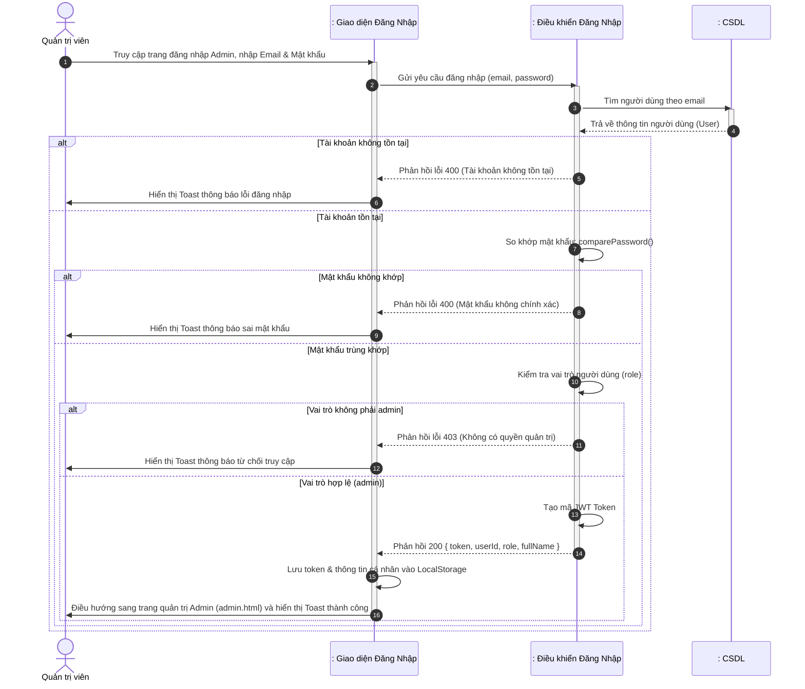
```mermaid
sequenceDiagram
    autonumber
    actor Admin as Quản trị viên
    participant LoginUI as : Giao diện Đăng Nhập
    participant LoginCtrl as : Điều khiển Đăng Nhập
    participant DB as : CSDL

    Admin ->> LoginUI: Truy cập trang đăng nhập Admin, nhập Email & Mật khẩu
    activate LoginUI
    LoginUI ->> LoginCtrl: Gửi yêu cầu đăng nhập (email, password)
    activate LoginCtrl
    LoginCtrl ->> DB: Tìm người dùng theo email
    activate DB
    DB -->> LoginCtrl: Trả về thông tin người dùng (User)
    deactivate DB

    alt Tài khoản không tồn tại
        LoginCtrl -->> LoginUI: Phản hồi lỗi 400 (Tài khoản không tồn tại)
        LoginUI ->> Admin: Hiển thị Toast thông báo lỗi đăng nhập
    else Tài khoản tồn tại
        LoginCtrl ->> LoginCtrl: So khớp mật khẩu: comparePassword()
        alt Mật khẩu không khớp
            LoginCtrl -->> LoginUI: Phản hồi lỗi 400 (Mật khẩu không chính xác)
            LoginUI ->> Admin: Hiển thị Toast thông báo sai mật khẩu
        else Mật khẩu trùng khớp
            LoginCtrl ->> LoginCtrl: Kiểm tra vai trò người dùng (role)
            alt Vai trò không phải admin
                LoginCtrl -->> LoginUI: Phản hồi lỗi 403 (Không có quyền quản trị)
                LoginUI ->> Admin: Hiển thị Toast thông báo từ chối truy cập
            else Vai trò hợp lệ (admin)
                LoginCtrl ->> LoginCtrl: Tạo mã JWT Token
                LoginCtrl -->> LoginUI: Phản hồi 200 { token, userId, role, fullName }
                deactivate LoginCtrl
                LoginUI ->> LoginUI: Lưu token & thông tin cá nhân vào LocalStorage
                LoginUI ->> Admin: Điều hướng sang trang quản trị Admin (admin.html) và hiển thị Toast thành công
                deactivate LoginUI
            end
        end
    end
```

### 1.2. Biểu đồ hoạt động
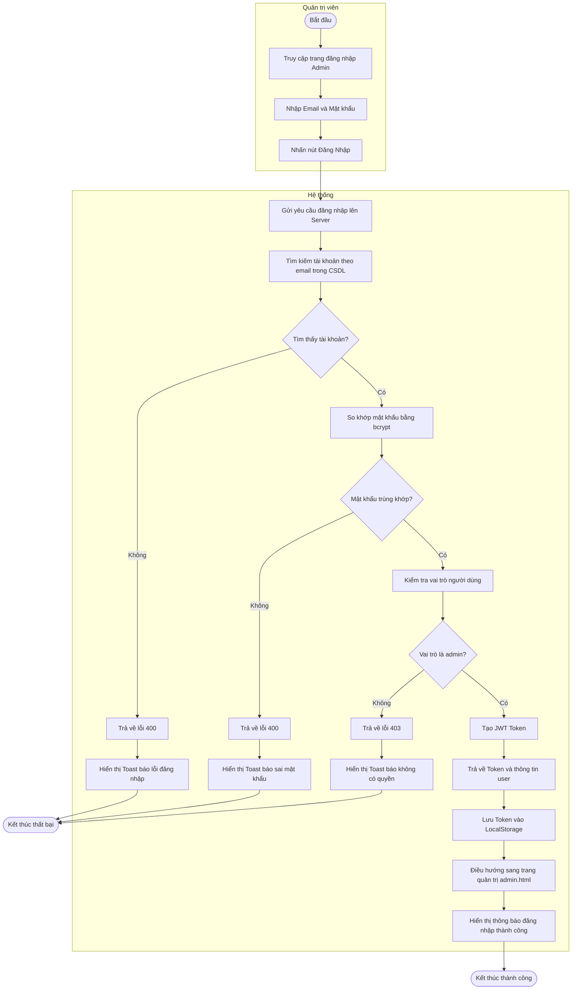
```mermaid
flowchart TD
    subgraph Quản trị viên
        Start1([Bắt đầu]) --> OpenLogin[Truy cập trang đăng nhập Admin]
        OpenLogin --> EnterCredentials[Nhập Email và Mật khẩu]
        EnterCredentials --> ClickLogin[Nhấn nút Đăng Nhập]
    end
    subgraph Hệ thống
        ClickLogin --> SendLoginReq[Gửi yêu cầu đăng nhập lên Server]
        SendLoginReq --> QueryUser[Tìm kiếm tài khoản theo email trong CSDL]
        QueryUser --> UserExist{Tìm thấy tài khoản?}
        UserExist -- Không --> ReturnErrNoUser[Trả về lỗi 400] --> ShowErrNoUser[Hiển thị Toast báo lỗi đăng nhập]
        UserExist -- Có --> MatchPW[So khớp mật khẩu bằng bcrypt]
        MatchPW --> PWCorrect{Mật khẩu trùng khớp?}
        PWCorrect -- Không --> ReturnErrPW[Trả về lỗi 400] --> ShowErrPW[Hiển thị Toast báo sai mật khẩu]
        PWCorrect -- Có --> CheckRole[Kiểm tra vai trò người dùng]
        CheckRole --> RoleValid{Vai trò là admin?}
        RoleValid -- Không --> ReturnForbidden[Trả về lỗi 403] --> ShowErrRole[Hiển thị Toast báo không có quyền]
        RoleValid -- Có --> GenerateJWT[Tạo JWT Token]
        GenerateJWT --> ReturnToken[Trả về Token và thông tin user]
        ReturnToken --> SaveLocal[Lưu Token vào LocalStorage]
        SaveLocal --> RedirectAdmin[Điều hướng sang trang quản trị admin.html]
        RedirectAdmin --> ShowSuccess[Hiển thị thông báo đăng nhập thành công]
    end
    ShowErrNoUser --> EndFail1([Kết thúc thất bại])
    ShowErrPW --> EndFail1
    ShowErrRole --> EndFail1
    ShowSuccess --> EndSuccess1([Kết thúc thành công])
```

---

## 2. QUẢN LÝ SẢN PHẨM (PRODUCT MANAGEMENT)

### 2.1. Biểu đồ tuần tự
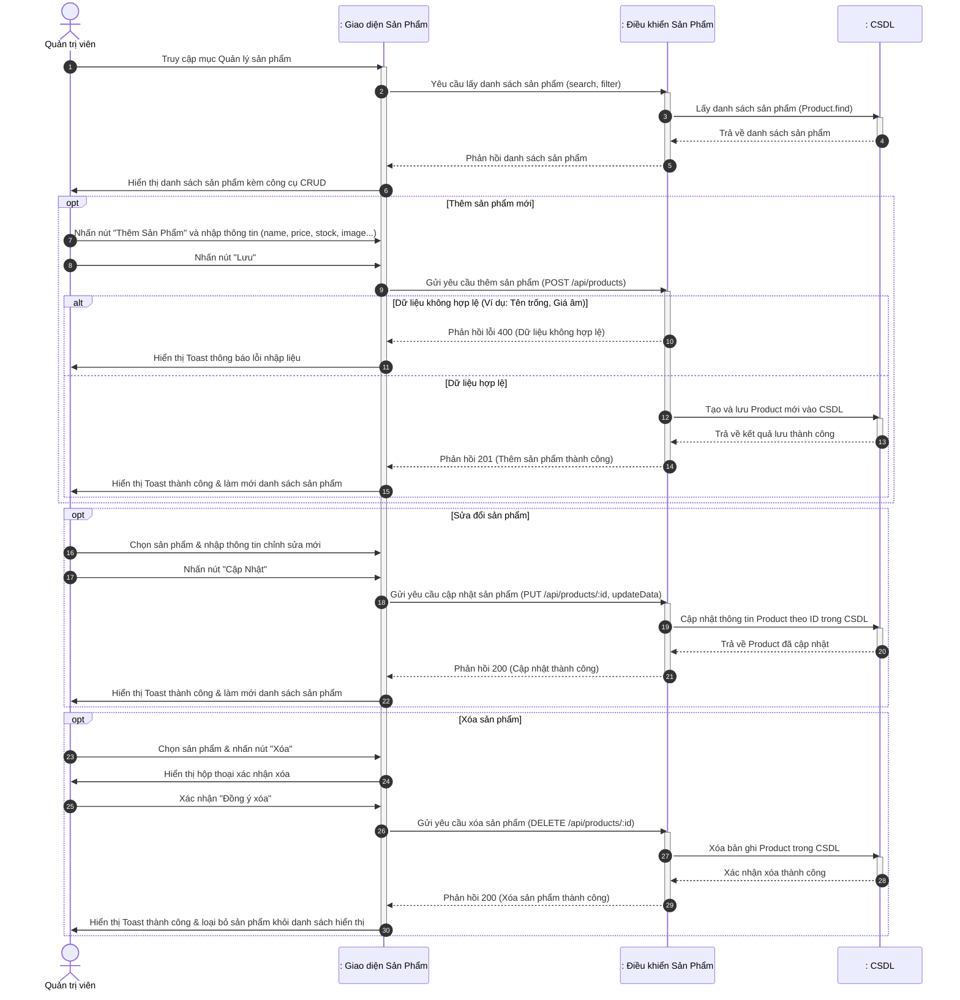
```mermaid
sequenceDiagram
    autonumber
    actor Admin as Quản trị viên
    participant ProductUI as : Giao diện Sản Phẩm
    participant ProductCtrl as : Điều khiển Sản Phẩm
    participant DB as : CSDL

    Admin ->> ProductUI: Truy cập mục Quản lý sản phẩm
    activate ProductUI
    ProductUI ->> ProductCtrl: Yêu cầu lấy danh sách sản phẩm (search, filter)
    activate ProductCtrl
    ProductCtrl ->> DB: Lấy danh sách sản phẩm (Product.find)
    activate DB
    DB -->> ProductCtrl: Trả về danh sách sản phẩm
    deactivate DB
    ProductCtrl -->> ProductUI: Phản hồi danh sách sản phẩm
    deactivate ProductCtrl
    ProductUI ->> Admin: Hiển thị danh sách sản phẩm kèm công cụ CRUD

    opt Thêm sản phẩm mới
        Admin ->> ProductUI: Nhấn nút "Thêm Sản Phẩm" và nhập thông tin (name, price, stock, image...)
        Admin ->> ProductUI: Nhấn nút "Lưu"
        ProductUI ->> ProductCtrl: Gửi yêu cầu thêm sản phẩm (POST /api/products)
        activate ProductCtrl
        
        alt Dữ liệu không hợp lệ (Ví dụ: Tên trống, Giá âm)
            ProductCtrl -->> ProductUI: Phản hồi lỗi 400 (Dữ liệu không hợp lệ)
            ProductUI ->> Admin: Hiển thị Toast thông báo lỗi nhập liệu
        else Dữ liệu hợp lệ
            ProductCtrl ->> DB: Tạo và lưu Product mới vào CSDL
            activate DB
            DB -->> ProductCtrl: Trả về kết quả lưu thành công
            deactivate DB
            ProductCtrl -->> ProductUI: Phản hồi 201 (Thêm sản phẩm thành công)
            deactivate ProductCtrl
            ProductUI ->> Admin: Hiển thị Toast thành công & làm mới danh sách sản phẩm
        end
    end

    opt Sửa đổi sản phẩm
        Admin ->> ProductUI: Chọn sản phẩm & nhập thông tin chỉnh sửa mới
        Admin ->> ProductUI: Nhấn nút "Cập Nhật"
        ProductUI ->> ProductCtrl: Gửi yêu cầu cập nhật sản phẩm (PUT /api/products/:id, updateData)
        activate ProductCtrl
        ProductCtrl ->> DB: Cập nhật thông tin Product theo ID trong CSDL
        activate DB
        DB -->> ProductCtrl: Trả về Product đã cập nhật
        deactivate DB
        ProductCtrl -->> ProductUI: Phản hồi 200 (Cập nhật thành công)
        deactivate ProductCtrl
        ProductUI ->> Admin: Hiển thị Toast thành công & làm mới danh sách sản phẩm
    end

    opt Xóa sản phẩm
        Admin ->> ProductUI: Chọn sản phẩm & nhấn nút "Xóa"
        ProductUI ->> Admin: Hiển thị hộp thoại xác nhận xóa
        Admin ->> ProductUI: Xác nhận "Đồng ý xóa"
        ProductUI ->> ProductCtrl: Gửi yêu cầu xóa sản phẩm (DELETE /api/products/:id)
        activate ProductCtrl
        ProductCtrl ->> DB: Xóa bản ghi Product trong CSDL
        activate DB
        DB -->> ProductCtrl: Xác nhận xóa thành công
        deactivate DB
        ProductCtrl -->> ProductUI: Phản hồi 200 (Xóa sản phẩm thành công)
        deactivate ProductCtrl
        ProductUI ->> Admin: Hiển thị Toast thành công & loại bỏ sản phẩm khỏi danh sách hiển thị
    end
    deactivate ProductUI
```

### 2.2. Biểu đồ hoạt động
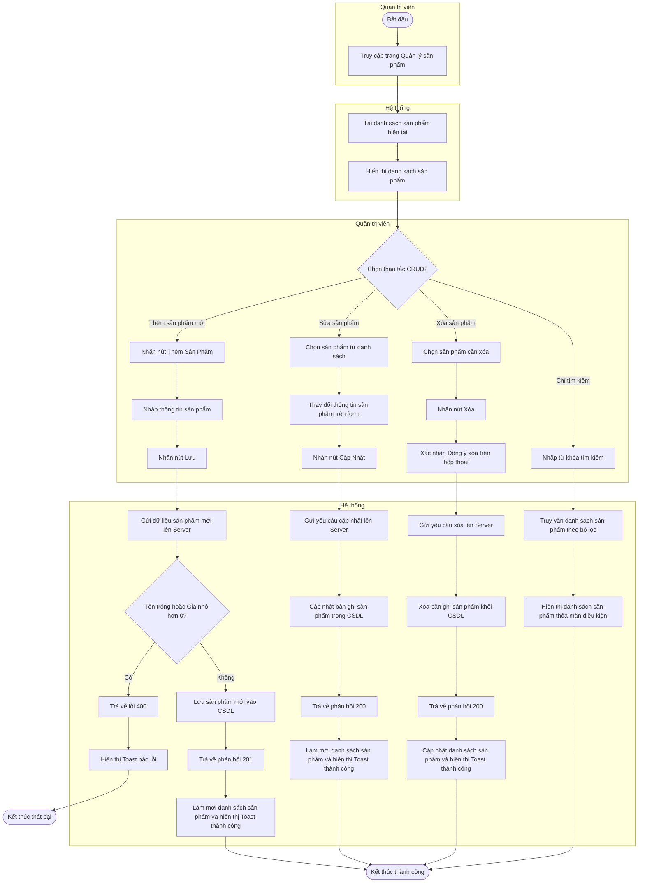
```mermaid
flowchart TD
    subgraph Quản trị viên
        Start2([Bắt đầu]) --> OpenProduct[Truy cập trang Quản lý sản phẩm]
    end
    subgraph Hệ thống
        OpenProduct --> LoadProducts[Tải danh sách sản phẩm hiện tại]
        LoadProducts --> DisplayProducts[Hiển thị danh sách sản phẩm]
    end
    subgraph Quản trị viên
        DisplayProducts --> ChooseProductAction{Chọn thao tác CRUD?}
        
        ChooseProductAction -- Thêm sản phẩm mới --> ClickAddProduct[Nhấn nút Thêm Sản Phẩm]
        ClickAddProduct --> FillProductForm[Nhập thông tin sản phẩm]
        FillProductForm --> ClickSaveProduct[Nhấn nút Lưu]
        
        ChooseProductAction -- Sửa sản phẩm --> SelectEditProduct[Chọn sản phẩm từ danh sách]
        SelectEditProduct --> EditProductForm[Thay đổi thông tin sản phẩm trên form]
        EditProductForm --> ClickUpdateProduct[Nhấn nút Cập Nhật]
        
        ChooseProductAction -- Xóa sản phẩm --> SelectDeleteProduct[Chọn sản phẩm cần xóa]
        SelectDeleteProduct --> ClickDeleteProduct[Nhấn nút Xóa]
        ClickDeleteProduct --> ConfirmDelete[Xác nhận Đồng ý xóa trên hộp thoại]
        
        ChooseProductAction -- Chỉ tìm kiếm --> EnterSearch[Nhập từ khóa tìm kiếm]
    end
    subgraph Hệ thống
        ClickSaveProduct --> SendAddReq[Gửi dữ liệu sản phẩm mới lên Server]
        SendAddReq --> ValidateProduct{Tên trống hoặc Giá nhỏ hơn 0?}
        ValidateProduct -- Có --> ReturnAddErr[Trả về lỗi 400] --> ShowAddErr[Hiển thị Toast báo lỗi]
        ValidateProduct -- Không --> SaveProductDB[Lưu sản phẩm mới vào CSDL]
        SaveProductDB --> ReturnAddSuccess[Trả về phản hồi 201]
        ReturnAddSuccess --> RefreshProductsAdd[Làm mới danh sách sản phẩm và hiển thị Toast thành công]
        
        ClickUpdateProduct --> SendUpdateReq[Gửi yêu cầu cập nhật lên Server]
        SendUpdateReq --> SaveUpdateDB[Cập nhật bản ghi sản phẩm trong CSDL]
        SaveUpdateDB --> ReturnUpdateSuccess[Trả về phản hồi 200]
        ReturnUpdateSuccess --> RefreshProductsUpdate[Làm mới danh sách sản phẩm và hiển thị Toast thành công]
        
        ConfirmDelete --> SendDeleteReq[Gửi yêu cầu xóa lên Server]
        SendDeleteReq --> DeleteProductDB[Xóa bản ghi sản phẩm khỏi CSDL]
        DeleteProductDB --> ReturnDeleteSuccess[Trả về phản hồi 200]
        ReturnDeleteSuccess --> RefreshProductsDelete[Cập nhật danh sách sản phẩm và hiển thị Toast thành công]
        
        EnterSearch --> QuerySearch[Truy vấn danh sách sản phẩm theo bộ lọc]
        QuerySearch --> DisplaySearch[Hiển thị danh sách sản phẩm thỏa mãn điều kiện]
    end
    ShowAddErr --> EndFail2([Kết thúc thất bại])
    RefreshProductsAdd --> EndSuccess2([Kết thúc thành công])
    RefreshProductsUpdate --> EndSuccess2
    RefreshProductsDelete --> EndSuccess2
    DisplaySearch --> EndSuccess2
```

---

## 3. QUẢN LÝ KHUYẾN MÃI (PROMOTION MANAGEMENT)

### 3.1. Biểu đồ tuần tự
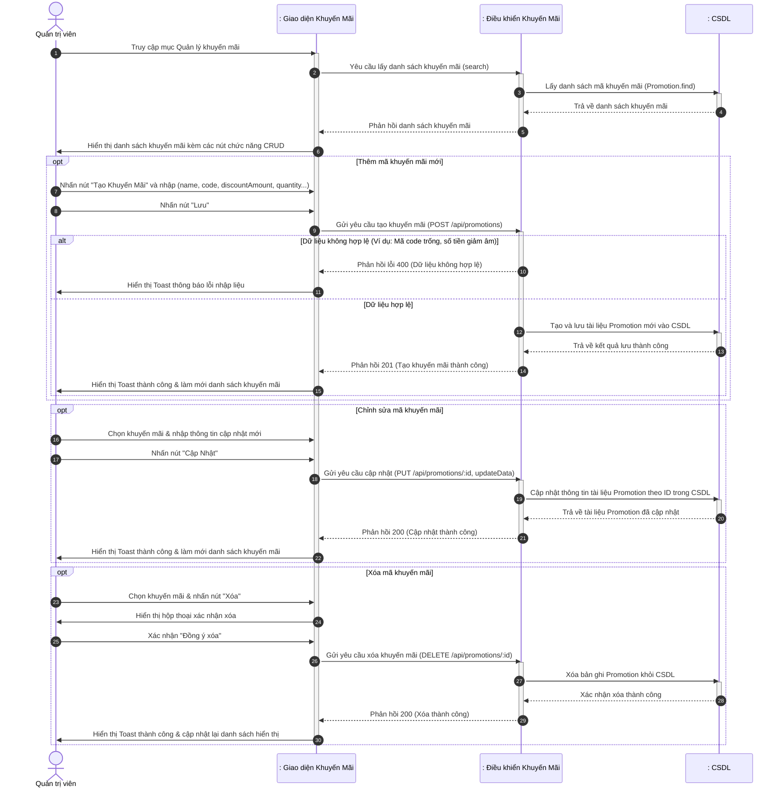
```mermaid
sequenceDiagram
    autonumber
    actor Admin as Quản trị viên
    participant PromotionUI as : Giao diện Khuyến Mãi
    participant PromotionCtrl as : Điều khiển Khuyến Mãi
    participant DB as : CSDL

    Admin ->> PromotionUI: Truy cập mục Quản lý khuyến mãi
    activate PromotionUI
    PromotionUI ->> PromotionCtrl: Yêu cầu lấy danh sách khuyến mãi (search)
    activate PromotionCtrl
    PromotionCtrl ->> DB: Lấy danh sách mã khuyến mãi (Promotion.find)
    activate DB
    DB -->> PromotionCtrl: Trả về danh sách khuyến mãi
    deactivate DB
    PromotionCtrl -->> PromotionUI: Phản hồi danh sách khuyến mãi
    deactivate PromotionCtrl
    PromotionUI ->> Admin: Hiển thị danh sách khuyến mãi kèm các nút chức năng CRUD

    opt Thêm mã khuyến mãi mới
        Admin ->> PromotionUI: Nhấn nút "Tạo Khuyến Mãi" và nhập (name, code, discountAmount, quantity...)
        Admin ->> PromotionUI: Nhấn nút "Lưu"
        PromotionUI ->> PromotionCtrl: Gửi yêu cầu tạo khuyến mãi (POST /api/promotions)
        activate PromotionCtrl
        
        alt Dữ liệu không hợp lệ (Ví dụ: Mã code trống, số tiền giảm âm)
            PromotionCtrl -->> PromotionUI: Phản hồi lỗi 400 (Dữ liệu không hợp lệ)
            PromotionUI ->> Admin: Hiển thị Toast thông báo lỗi nhập liệu
        else Dữ liệu hợp lệ
            PromotionCtrl ->> DB: Tạo và lưu tài liệu Promotion mới vào CSDL
            activate DB
            DB -->> PromotionCtrl: Trả về kết quả lưu thành công
            deactivate DB
            PromotionCtrl -->> PromotionUI: Phản hồi 201 (Tạo khuyến mãi thành công)
            deactivate PromotionCtrl
            PromotionUI ->> Admin: Hiển thị Toast thành công & làm mới danh sách khuyến mãi
        end
    end

    opt Chỉnh sửa mã khuyến mãi
        Admin ->> PromotionUI: Chọn khuyến mãi & nhập thông tin cập nhật mới
        Admin ->> PromotionUI: Nhấn nút "Cập Nhật"
        PromotionUI ->> PromotionCtrl: Gửi yêu cầu cập nhật (PUT /api/promotions/:id, updateData)
        activate PromotionCtrl
        PromotionCtrl ->> DB: Cập nhật thông tin tài liệu Promotion theo ID trong CSDL
        activate DB
        DB -->> PromotionCtrl: Trả về tài liệu Promotion đã cập nhật
        deactivate DB
        PromotionCtrl -->> PromotionUI: Phản hồi 200 (Cập nhật thành công)
        deactivate PromotionCtrl
        PromotionUI ->> Admin: Hiển thị Toast thành công & làm mới danh sách khuyến mãi
    end

    opt Xóa mã khuyến mãi
        Admin ->> PromotionUI: Chọn khuyến mãi & nhấn nút "Xóa"
        PromotionUI ->> Admin: Hiển thị hộp thoại xác nhận xóa
        Admin ->> PromotionUI: Xác nhận "Đồng ý xóa"
        PromotionUI ->> PromotionCtrl: Gửi yêu cầu xóa khuyến mãi (DELETE /api/promotions/:id)
        activate PromotionCtrl
        PromotionCtrl ->> DB: Xóa bản ghi Promotion khỏi CSDL
        activate DB
        DB -->> PromotionCtrl: Xác nhận xóa thành công
        deactivate DB
        PromotionCtrl -->> PromotionUI: Phản hồi 200 (Xóa thành công)
        deactivate PromotionCtrl
        PromotionUI ->> Admin: Hiển thị Toast thành công & cập nhật lại danh sách hiển thị
    end
    deactivate PromotionUI
```

### 3.2. Biểu đồ hoạt động
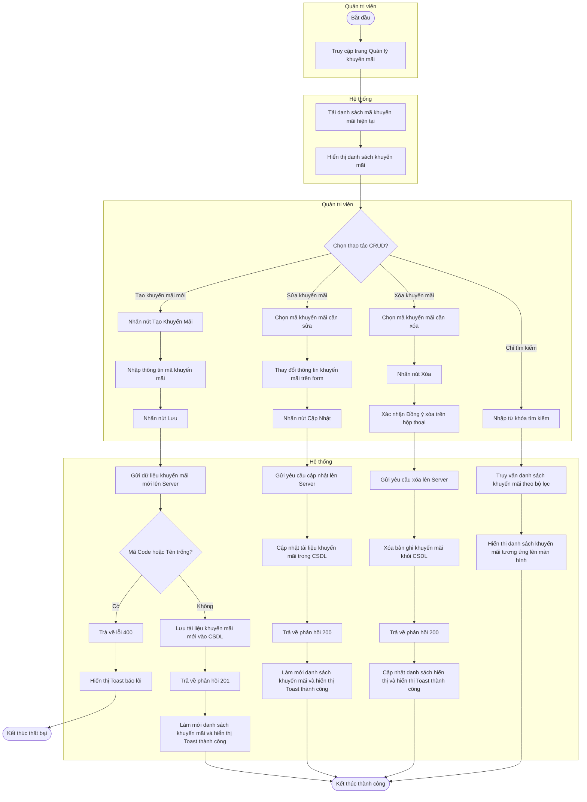
```mermaid
flowchart TD
    subgraph Quản trị viên
        Start3([Bắt đầu]) --> OpenPromotion[Truy cập trang Quản lý khuyến mãi]
    end
    subgraph Hệ thống
        OpenPromotion --> LoadPromotions[Tải danh sách mã khuyến mãi hiện tại]
        LoadPromotions --> DisplayPromotions[Hiển thị danh sách khuyến mãi]
    end
    subgraph Quản trị viên
        DisplayPromotions --> ChoosePromoAction{Chọn thao tác CRUD?}
        
        ChoosePromoAction -- Tạo khuyến mãi mới --> ClickAddPromo[Nhấn nút Tạo Khuyến Mãi]
        ClickAddPromo --> FillPromoForm[Nhập thông tin mã khuyến mãi]
        FillPromoForm --> ClickSavePromo[Nhấn nút Lưu]
        
        ChoosePromoAction -- Sửa khuyến mãi --> SelectEditPromo[Chọn mã khuyến mãi cần sửa]
        SelectEditPromo --> EditPromoForm[Thay đổi thông tin khuyến mãi trên form]
        EditPromoForm --> ClickUpdatePromo[Nhấn nút Cập Nhật]
        
        ChoosePromoAction -- Xóa khuyến mãi --> SelectDeletePromo[Chọn mã khuyến mãi cần xóa]
        SelectDeletePromo --> ClickDeletePromo[Nhấn nút Xóa]
        ClickDeletePromo --> ConfirmDeletePromo[Xác nhận Đồng ý xóa trên hộp thoại]
        
        ChoosePromoAction -- Chỉ tìm kiếm --> EnterSearchPromo[Nhập từ khóa tìm kiếm]
    end
    subgraph Hệ thống
        ClickSavePromo --> SendAddPromoReq[Gửi dữ liệu khuyến mãi mới lên Server]
        SendAddPromoReq --> ValidatePromo{Mã Code hoặc Tên trống?}
        ValidatePromo -- Có --> ReturnAddPromoErr[Trả về lỗi 400] --> ShowAddPromoErr[Hiển thị Toast báo lỗi]
        ValidatePromo -- Không --> SavePromoDB[Lưu tài liệu khuyến mãi mới vào CSDL]
        SavePromoDB --> ReturnAddPromoSuccess[Trả về phản hồi 201]
        ReturnAddPromoSuccess --> RefreshPromoAdd[Làm mới danh sách khuyến mãi và hiển thị Toast thành công]
        
        ClickUpdatePromo --> SendUpdatePromoReq[Gửi yêu cầu cập nhật lên Server]
        SendUpdatePromoReq --> SaveUpdatePromoDB[Cập nhật tài liệu khuyến mãi trong CSDL]
        SaveUpdatePromoDB --> ReturnUpdatePromoSuccess[Trả về phản hồi 200]
        ReturnUpdatePromoSuccess --> RefreshPromoUpdate[Làm mới danh sách khuyến mãi và hiển thị Toast thành công]
        
        ConfirmDeletePromo --> SendDeletePromoReq[Gửi yêu cầu xóa lên Server]
        SendDeletePromoReq --> DeletePromoDB[Xóa bản ghi khuyến mãi khỏi CSDL]
        DeletePromoDB --> ReturnDeletePromoSuccess[Trả về phản hồi 200]
        ReturnDeletePromoSuccess --> RefreshPromoDelete[Cập nhật danh sách hiển thị và hiển thị Toast thành công]
        
        EnterSearchPromo --> QuerySearchPromo[Truy vấn danh sách khuyến mãi theo bộ lọc]
        QuerySearchPromo --> DisplaySearchPromo[Hiển thị danh sách khuyến mãi tương ứng lên màn hình]
    end
    ShowAddPromoErr --> EndFail3([Kết thúc thất bại])
    RefreshPromoAdd --> EndSuccess3([Kết thúc thành công])
    RefreshPromoUpdate --> EndSuccess3
    RefreshPromoDelete --> EndSuccess3
    DisplaySearchPromo --> EndSuccess3
```

---

## 4. QUẢN LÝ CHẤM CÔNG (ATTENDANCE MANAGEMENT)

### 4.1. Biểu đồ tuần tự
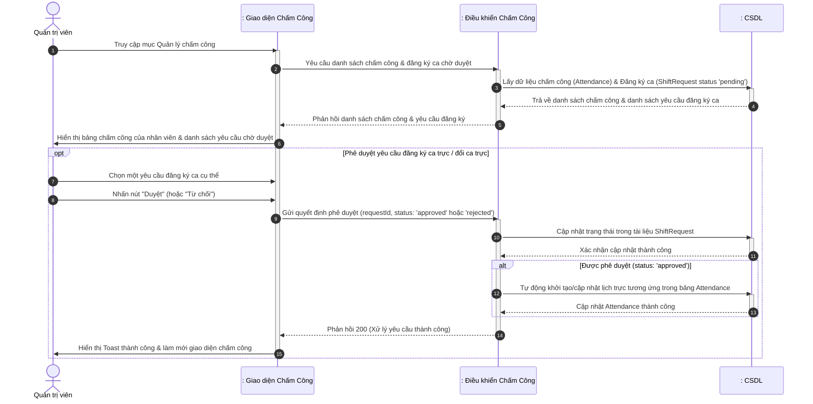
```mermaid
sequenceDiagram
    autonumber
    actor Admin as Quản trị viên
    participant AttendanceUI as : Giao diện Chấm Công
    participant AttendanceCtrl as : Điều khiển Chấm Công
    participant DB as : CSDL

    Admin ->> AttendanceUI: Truy cập mục Quản lý chấm công
    activate AttendanceUI
    AttendanceUI ->> AttendanceCtrl: Yêu cầu danh sách chấm công & đăng ký ca chờ duyệt
    activate AttendanceCtrl
    AttendanceCtrl ->> DB: Lấy dữ liệu chấm công (Attendance) & Đăng ký ca (ShiftRequest status 'pending')
    activate DB
    DB -->> AttendanceCtrl: Trả về danh sách chấm công & danh sách yêu cầu đăng ký ca
    deactivate DB
    AttendanceCtrl -->> AttendanceUI: Phản hồi danh sách chấm công & yêu cầu đăng ký
    deactivate AttendanceCtrl
    AttendanceUI ->> Admin: Hiển thị bảng chấm công của nhân viên & danh sách yêu cầu chờ duyệt

    opt Phê duyệt yêu cầu đăng ký ca trực / đổi ca trực
        Admin ->> AttendanceUI: Chọn một yêu cầu đăng ký ca cụ thể
        Admin ->> AttendanceUI: Nhấn nút "Duyệt" (hoặc "Từ chối")
        AttendanceUI ->> AttendanceCtrl: Gửi quyết định phê duyệt (requestId, status: 'approved' hoặc 'rejected')
        activate AttendanceCtrl
        AttendanceCtrl ->> DB: Cập nhật trạng thái trong tài liệu ShiftRequest
        activate DB
        DB -->> AttendanceCtrl: Xác nhận cập nhật thành công
        deactivate DB
        
        alt Được phê duyệt (status: 'approved')
            AttendanceCtrl ->> DB: Tự động khởi tạo/cập nhật lịch trực tương ứng trong bảng Attendance
            activate DB
            DB -->> AttendanceCtrl: Cập nhật Attendance thành công
            deactivate DB
        end
        
        AttendanceCtrl -->> AttendanceUI: Phản hồi 200 (Xử lý yêu cầu thành công)
        deactivate AttendanceCtrl
        AttendanceUI ->> Admin: Hiển thị Toast thành công & làm mới giao diện chấm công
    end
    deactivate AttendanceUI
```

### 4.2. Biểu đồ hoạt động
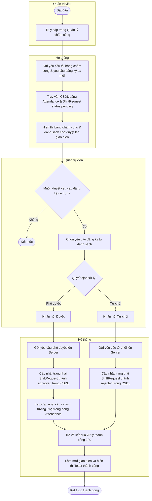
```mermaid
flowchart TD
    subgraph Quản trị viên
        Start4([Bắt đầu]) --> OpenAttendance[Truy cập trang Quản lý chấm công]
    end
    subgraph Hệ thống
        OpenAttendance --> LoadAttendanceData[Gửi yêu cầu tải bảng chấm công & yêu cầu đăng ký ca mới]
        LoadAttendanceData --> QueryAttendanceDB[Truy vấn CSDL bảng Attendance & ShiftRequest status pending]
        QueryAttendanceDB --> RenderAttendanceUI[Hiển thị bảng chấm công & danh sách chờ duyệt lên giao diện]
    end
    subgraph Quản trị viên
        RenderAttendanceUI --> CheckShiftRequests{Muốn duyệt yêu cầu đăng ký ca trực?}
        CheckShiftRequests -- Không --> EndNoShiftAction([Kết thúc])
        CheckShiftRequests -- Có --> SelectRequest[Chọn yêu cầu đăng ký từ danh sách]
        SelectRequest --> DecideRequest{Quyết định xử lý?}
        
        DecideRequest -- Phê duyệt --> ClickApprove[Nhấn nút Duyệt]
        DecideRequest -- Từ chối --> ClickReject[Nhấn nút Từ chối]
    end
    subgraph Hệ thống
        ClickApprove --> SendApproveReq[Gửi yêu cầu phê duyệt lên Server]
        SendApproveReq --> ApproveShiftDB[Cập nhật trạng thái ShiftRequest thành approved trong CSDL]
        ApproveShiftDB --> CreateAttendanceRecord[Tạo/Cập nhật các ca trực tương ứng trong bảng Attendance]
        CreateAttendanceRecord --> ReturnApproveOk[Trả về kết quả xử lý thành công 200]
        
        ClickReject --> SendRejectReq[Gửi yêu cầu từ chối lên Server]
        SendRejectReq --> RejectShiftDB[Cập nhật trạng thái ShiftRequest thành rejected trong CSDL]
        RejectShiftDB --> ReturnApproveOk
        
        ReturnApproveOk --> RefreshAttendanceUI[Làm mới giao diện và hiển thị Toast thành công]
    end
    RefreshAttendanceUI --> EndSuccess4([Kết thúc thành công])
```

---

## 5. QUẢN LÝ LƯƠNG (SALARY MANAGEMENT)

### 5.1. Biểu đồ tuần tự
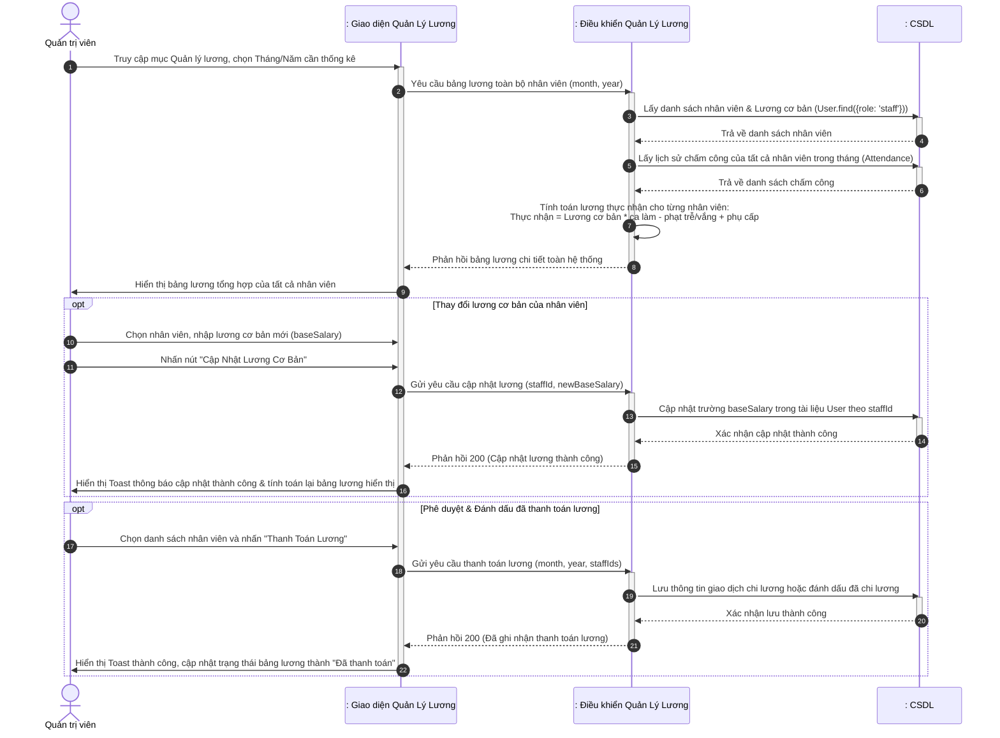
```mermaid
sequenceDiagram
    autonumber
    actor Admin as Quản trị viên
    participant SalaryUI as : Giao diện Quản Lý Lương
    participant SalaryCtrl as : Điều khiển Quản Lý Lương
    participant DB as : CSDL

    Admin ->> SalaryUI: Truy cập mục Quản lý lương, chọn Tháng/Năm cần thống kê
    activate SalaryUI
    SalaryUI ->> SalaryCtrl: Yêu cầu bảng lương toàn bộ nhân viên (month, year)
    activate SalaryCtrl
    SalaryCtrl ->> DB: Lấy danh sách nhân viên & Lương cơ bản (User.find({role: 'staff'}))
    activate DB
    DB -->> SalaryCtrl: Trả về danh sách nhân viên
    deactivate DB

    SalaryCtrl ->> DB: Lấy lịch sử chấm công của tất cả nhân viên trong tháng (Attendance)
    activate DB
    DB -->> SalaryCtrl: Trả về danh sách chấm công
    deactivate DB

    SalaryCtrl ->> SalaryCtrl: Tính toán lương thực nhận cho từng nhân viên:<br>Thực nhận = Lương cơ bản * ca làm - phạt trễ/vắng + phụ cấp
    SalaryCtrl -->> SalaryUI: Phản hồi bảng lương chi tiết toàn hệ thống
    deactivate SalaryCtrl
    SalaryUI ->> Admin: Hiển thị bảng lương tổng hợp của tất cả nhân viên

    opt Thay đổi lương cơ bản của nhân viên
        Admin ->> SalaryUI: Chọn nhân viên, nhập lương cơ bản mới (baseSalary)
        Admin ->> SalaryUI: Nhấn nút "Cập Nhật Lương Cơ Bản"
        SalaryUI ->> SalaryCtrl: Gửi yêu cầu cập nhật lương (staffId, newBaseSalary)
        activate SalaryCtrl
        SalaryCtrl ->> DB: Cập nhật trường baseSalary trong tài liệu User theo staffId
        activate DB
        DB -->> SalaryCtrl: Xác nhận cập nhật thành công
        deactivate DB
        SalaryCtrl -->> SalaryUI: Phản hồi 200 (Cập nhật lương thành công)
        deactivate SalaryCtrl
        SalaryUI ->> Admin: Hiển thị Toast thông báo cập nhật thành công & tính toán lại bảng lương hiển thị
    end

    opt Phê duyệt & Đánh dấu đã thanh toán lương
        Admin ->> SalaryUI: Chọn danh sách nhân viên và nhấn "Thanh Toán Lương"
        SalaryUI ->> SalaryCtrl: Gửi yêu cầu thanh toán lương (month, year, staffIds)
        activate SalaryCtrl
        SalaryCtrl ->> DB: Lưu thông tin giao dịch chi lương hoặc đánh dấu đã chi lương
        activate DB
        DB -->> SalaryCtrl: Xác nhận lưu thành công
        deactivate DB
        SalaryCtrl -->> SalaryUI: Phản hồi 200 (Đã ghi nhận thanh toán lương)
        deactivate SalaryCtrl
        SalaryUI ->> Admin: Hiển thị Toast thành công, cập nhật trạng thái bảng lương thành "Đã thanh toán"
    end
    deactivate SalaryUI
```

### 5.2. Biểu đồ hoạt động
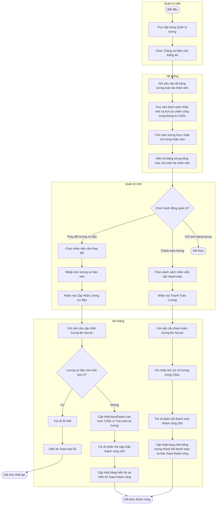
```mermaid
flowchart TD
    subgraph Quản trị viên
        Start5([Bắt đầu]) --> OpenSalaryAdmin[Truy cập trang Quản lý lương]
        OpenSalaryAdmin --> SelectSalaryPeriod[Chọn Tháng và Năm cần thống kê]
    end
    subgraph Hệ thống
        SelectSalaryPeriod --> RequestAllSalaries[Gửi yêu cầu tải bảng lương toàn bộ nhân viên]
        RequestAllSalaries --> QueryStaffDB[Truy vấn danh sách nhân viên và lịch sử chấm công trong tháng từ CSDL]
        QueryStaffDB --> CalculateAllSalaries[Tính toán lương thực nhận cho từng nhân viên]
        CalculateAllSalaries --> DisplaySalaryUI[Hiển thị bảng lương tổng hợp của toàn bộ nhân viên]
    end
    subgraph Quản trị viên
        DisplaySalaryUI --> ChooseSalaryAction{Chọn hành động quản lý?}
        
        ChooseSalaryAction -- Thay đổi lương cơ bản --> SelectStaffSalary[Chọn nhân viên cần thay đổi]
        SelectStaffSalary --> InputNewBaseSalary[Nhập mức lương cơ bản mới]
        InputNewBaseSalary --> ClickSaveBaseSalary[Nhấn nút Cập Nhật Lương Cơ Bản]
        
        ChooseSalaryAction -- Thanh toán lương --> SelectPayoutStaffs[Chọn danh sách nhân viên cần thanh toán]
        SelectPayoutStaffs --> ClickPaySalaries[Nhấn nút Thanh Toán Lương]
        
        ChooseSalaryAction -- Chỉ xem bảng lương --> EndSalaryView([Kết thúc])
    end
    subgraph Hệ thống
        ClickSaveBaseSalary --> SendUpdateBaseSalary[Gửi yêu cầu cập nhật lương lên Server]
        SendUpdateBaseSalary --> CheckBaseSalaryVal{Lương cơ bản mới nhỏ hơn 0?}
        CheckBaseSalaryVal -- Có --> ReturnSalaryValErr[Trả về lỗi 400] --> ShowSalaryValErr[Hiển thị Toast báo lỗi]
        CheckBaseSalaryVal -- Không --> UpdateBaseSalaryDB[Cập nhật baseSalary vào User CSDL & Tính toán lại lương]
        UpdateBaseSalaryDB --> ReturnSalaryValOk[Trả về phản hồi cập nhật thành công 200]
        ReturnSalaryValOk --> RefreshSalaryUI[Cập nhật bảng hiển thị và hiển thị Toast thành công]
        
        ClickPaySalaries --> SendPaySalaries[Gửi yêu cầu thanh toán lương lên Server]
        SendPaySalaries --> SavePayoutDB[Ghi nhận lịch sử chi lương trong CSDL]
        SavePayoutDB --> ReturnPaySuccess[Trả về phản hồi thanh toán thành công 200]
        ReturnPaySuccess --> RefreshPayoutUI[Cập nhật trạng thái bảng lương thành Đã thanh toán và báo Toast thành công]
    end
    ShowSalaryValErr --> EndFail5([Kết thúc thất bại])
    RefreshSalaryUI --> EndSuccess5([Kết thúc thành công])
    RefreshPayoutUI --> EndSuccess5
```

---

## 6. QUẢN LÝ TÀI KHOẢN USER (USER ACCOUNT MANAGEMENT)

### 6.1. Biểu đồ tuần tự
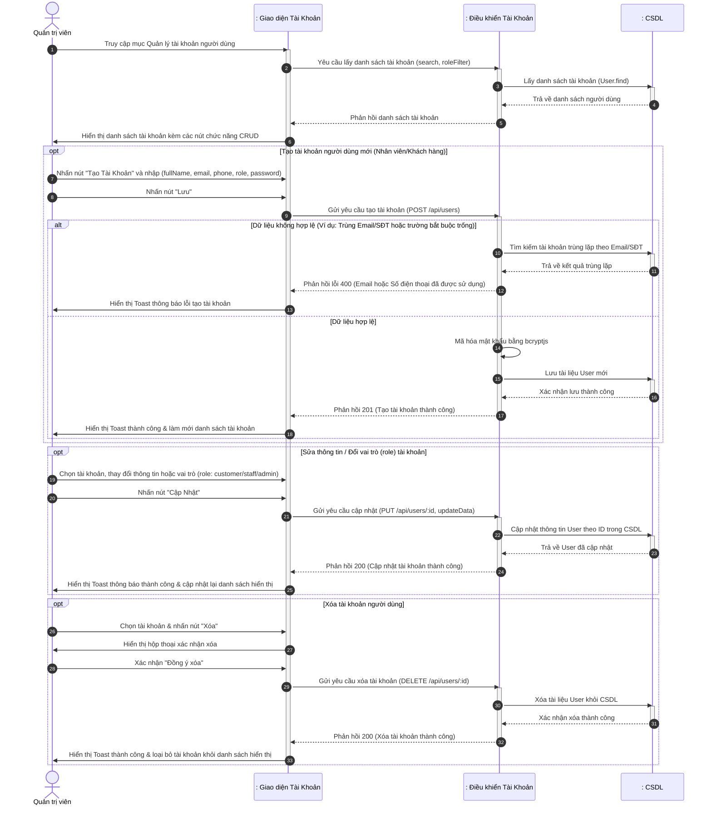
```mermaid
sequenceDiagram
    autonumber
    actor Admin as Quản trị viên
    participant UserAccountUI as : Giao diện Tài Khoản
    participant UserAccountCtrl as : Điều khiển Tài Khoản
    participant DB as : CSDL

    Admin ->> UserAccountUI: Truy cập mục Quản lý tài khoản người dùng
    activate UserAccountUI
    UserAccountUI ->> UserAccountCtrl: Yêu cầu lấy danh sách tài khoản (search, roleFilter)
    activate UserAccountCtrl
    UserAccountCtrl ->> DB: Lấy danh sách tài khoản (User.find)
    activate DB
    DB -->> UserAccountCtrl: Trả về danh sách người dùng
    deactivate DB
    UserAccountCtrl -->> UserAccountUI: Phản hồi danh sách tài khoản
    deactivate UserAccountCtrl
    UserAccountUI ->> Admin: Hiển thị danh sách tài khoản kèm các nút chức năng CRUD

    opt Tạo tài khoản người dùng mới (Nhân viên/Khách hàng)
        Admin ->> UserAccountUI: Nhấn nút "Tạo Tài Khoản" và nhập (fullName, email, phone, role, password)
        Admin ->> UserAccountUI: Nhấn nút "Lưu"
        UserAccountUI ->> UserAccountCtrl: Gửi yêu cầu tạo tài khoản (POST /api/users)
        activate UserAccountCtrl
        
        alt Dữ liệu không hợp lệ (Ví dụ: Trùng Email/SĐT hoặc trường bắt buộc trống)
            UserAccountCtrl ->> DB: Tìm kiếm tài khoản trùng lặp theo Email/SĐT
            activate DB
            DB -->> UserAccountCtrl: Trả về kết quả trùng lặp
            deactivate DB
            UserAccountCtrl -->> UserAccountUI: Phản hồi lỗi 400 (Email hoặc Số điện thoại đã được sử dụng)
            UserAccountUI ->> Admin: Hiển thị Toast thông báo lỗi tạo tài khoản
        else Dữ liệu hợp lệ
            UserAccountCtrl ->> UserAccountCtrl: Mã hóa mật khẩu bằng bcryptjs
            UserAccountCtrl ->> DB: Lưu tài liệu User mới
            activate DB
            DB -->> UserAccountCtrl: Xác nhận lưu thành công
            deactivate DB
            UserAccountCtrl -->> UserAccountUI: Phản hồi 201 (Tạo tài khoản thành công)
            deactivate UserAccountCtrl
            UserAccountUI ->> Admin: Hiển thị Toast thành công & làm mới danh sách tài khoản
        end
    end

    opt Sửa thông tin / Đổi vai trò (role) tài khoản
        Admin ->> UserAccountUI: Chọn tài khoản, thay đổi thông tin hoặc vai trò (role: customer/staff/admin)
        Admin ->> UserAccountUI: Nhấn nút "Cập Nhật"
        UserAccountUI ->> UserAccountCtrl: Gửi yêu cầu cập nhật (PUT /api/users/:id, updateData)
        activate UserAccountCtrl
        UserAccountCtrl ->> DB: Cập nhật thông tin User theo ID trong CSDL
        activate DB
        DB -->> UserAccountCtrl: Trả về User đã cập nhật
        deactivate DB
        UserAccountCtrl -->> UserAccountUI: Phản hồi 200 (Cập nhật tài khoản thành công)
        deactivate UserAccountCtrl
        UserAccountUI ->> Admin: Hiển thị Toast thông báo thành công & cập nhật lại danh sách hiển thị
    end

    opt Xóa tài khoản người dùng
        Admin ->> UserAccountUI: Chọn tài khoản & nhấn nút "Xóa"
        UserAccountUI ->> Admin: Hiển thị hộp thoại xác nhận xóa
        Admin ->> UserAccountUI: Xác nhận "Đồng ý xóa"
        UserAccountUI ->> UserAccountCtrl: Gửi yêu cầu xóa tài khoản (DELETE /api/users/:id)
        activate UserAccountCtrl
        UserAccountCtrl ->> DB: Xóa tài liệu User khỏi CSDL
        activate DB
        DB -->> UserAccountCtrl: Xác nhận xóa thành công
        deactivate DB
        UserAccountCtrl -->> UserAccountUI: Phản hồi 200 (Xóa tài khoản thành công)
        deactivate UserAccountCtrl
        UserAccountUI ->> Admin: Hiển thị Toast thành công & loại bỏ tài khoản khỏi danh sách hiển thị
    end
    deactivate UserAccountUI
```

### 6.2. Biểu đồ hoạt động
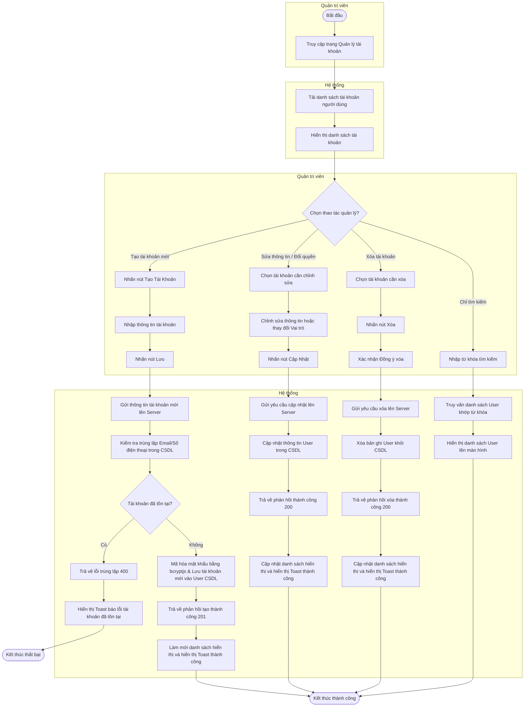
```mermaid
flowchart TD
    subgraph Quản trị viên
        Start6([Bắt đầu]) --> OpenUsersAdmin[Truy cập trang Quản lý tài khoản]
    end
    subgraph Hệ thống
        OpenUsersAdmin --> LoadUsersData[Tải danh sách tài khoản người dùng]
        LoadUsersData --> DisplayUsersUI[Hiển thị danh sách tài khoản]
    end
    subgraph Quản trị viên
        DisplayUsersUI --> ChooseUserAction{Chọn thao tác quản lý?}
        
        ChooseUserAction -- Tạo tài khoản mới --> ClickAddUser[Nhấn nút Tạo Tài Khoản]
        ClickAddUser --> FillUserForm[Nhập thông tin tài khoản]
        FillUserForm --> ClickSaveUser[Nhấn nút Lưu]
        
        ChooseUserAction -- Sửa thông tin / Đổi quyền --> SelectEditUser[Chọn tài khoản cần chỉnh sửa]
        SelectEditUser --> EditUserForm[Chỉnh sửa thông tin hoặc thay đổi Vai trò]
        EditUserForm --> ClickUpdateUser[Nhấn nút Cập Nhật]
        
        ChooseUserAction -- Xóa tài khoản --> SelectDeleteUser[Chọn tài khoản cần xóa]
        SelectDeleteUser --> ClickDeleteUser[Nhấn nút Xóa]
        ClickDeleteUser --> ConfirmDeleteUser[Xác nhận Đồng ý xóa]
        
        ChooseUserAction -- Chỉ tìm kiếm --> EnterSearchUser[Nhập từ khóa tìm kiếm]
    end
    subgraph Hệ thống
        ClickSaveUser --> SendCreateUserReq[Gửi thông tin tài khoản mới lên Server]
        SendCreateUserReq --> CheckUserExists[Kiểm tra trùng lặp Email/Số điện thoại trong CSDL]
        CheckUserExists --> IsUserUnique{Tài khoản đã tồn tại?}
        IsUserUnique -- Có --> ReturnCreateUserErr[Trả về lỗi trùng lặp 400] --> ShowCreateUserErr[Hiển thị Toast báo lỗi tài khoản đã tồn tại]
        IsUserUnique -- Không --> SaveUserDB[Mã hóa mật khẩu bằng bcryptjs & Lưu tài khoản mới vào User CSDL]
        SaveUserDB --> ReturnCreateUserSuccess[Trả về phản hồi tạo thành công 201]
        ReturnCreateUserSuccess --> RefreshUserAdd[Làm mới danh sách hiển thị và hiển thị Toast thành công]
        
        ClickUpdateUser --> SendUpdateUserReq[Gửi yêu cầu cập nhật lên Server]
        SendUpdateUserReq --> UpdateUserDB[Cập nhật thông tin User trong CSDL]
        UpdateUserDB --> ReturnUpdateUserSuccess[Trả về phản hồi thành công 200]
        ReturnUpdateUserSuccess --> RefreshUserUpdate[Cập nhật danh sách hiển thị và hiển thị Toast thành công]
        
        ConfirmDeleteUser --> SendDeleteUserReq[Gửi yêu cầu xóa lên Server]
        SendDeleteUserReq --> DeleteUserDB[Xóa bản ghi User khỏi CSDL]
        DeleteUserDB --> ReturnDeleteUserSuccess[Trả về phản hồi xóa thành công 200]
        ReturnDeleteUserSuccess --> RefreshUserDelete[Cập nhật danh sách hiển thị và hiển thị Toast thành công]
        
        EnterSearchUser --> QuerySearchUser[Truy vấn danh sách User khớp từ khóa]
        QuerySearchUser --> DisplaySearchUser[Hiển thị danh sách User lên màn hình]
    end
    ShowCreateUserErr --> EndFail6([Kết thúc thất bại])
    RefreshUserAdd --> EndSuccess6([Kết thúc thành công])
    RefreshUserUpdate --> EndSuccess6
    RefreshUserDelete --> EndSuccess6
    DisplaySearchUser --> EndSuccess6
```

---

## 7. XEM BÁO CÁO TÀI CHÍNH (FINANCIAL REPORT)

### 7.1. Biểu đồ tuần tự
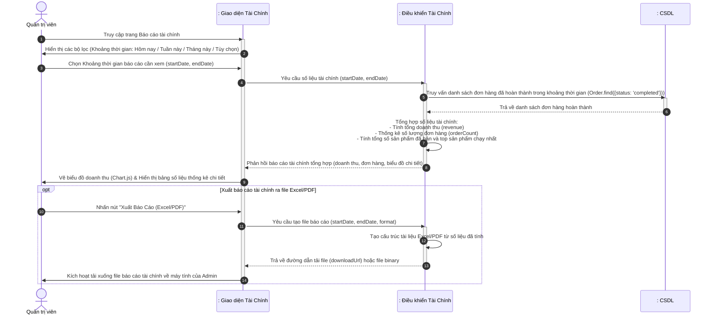
```mermaid
sequenceDiagram
    autonumber
    actor Admin as Quản trị viên
    participant FinanceUI as : Giao diện Tài Chính
    participant FinanceCtrl as : Điều khiển Tài Chính
    participant DB as : CSDL

    Admin ->> FinanceUI: Truy cập trang Báo cáo tài chính
    activate FinanceUI
    FinanceUI ->> Admin: Hiển thị các bộ lọc (Khoảng thời gian: Hôm nay / Tuần này / Tháng này / Tùy chọn)
    Admin ->> FinanceUI: Chọn Khoảng thời gian báo cáo cần xem (startDate, endDate)
    FinanceUI ->> FinanceCtrl: Yêu cầu số liệu tài chính (startDate, endDate)
    activate FinanceCtrl
    FinanceCtrl ->> DB: Truy vấn danh sách đơn hàng đã hoàn thành trong khoảng thời gian (Order.find({status: 'completed'}))
    activate DB
    DB -->> FinanceCtrl: Trả về danh sách đơn hàng hoàn thành
    deactivate DB

    FinanceCtrl ->> FinanceCtrl: Tổng hợp số liệu tài chính:<br>- Tính tổng doanh thu (revenue)<br>- Thống kê số lượng đơn hàng (orderCount)<br>- Tính tổng số sản phẩm đã bán và top sản phẩm chạy nhất
    FinanceCtrl -->> FinanceUI: Phản hồi báo cáo tài chính tổng hợp (doanh thu, đơn hàng, biểu đồ chi tiết)
    deactivate FinanceCtrl
    FinanceUI ->> Admin: Vẽ biểu đồ doanh thu (Chart.js) & Hiển thị bảng số liệu thống kê chi tiết

    opt Xuất báo cáo tài chính ra file Excel/PDF
        Admin ->> FinanceUI: Nhấn nút "Xuất Báo Cáo (Excel/PDF)"
        FinanceUI ->> FinanceCtrl: Yêu cầu tạo file báo cáo (startDate, endDate, format)
        activate FinanceCtrl
        FinanceCtrl ->> FinanceCtrl: Tạo cấu trúc tài liệu Excel/PDF từ số liệu đã tính
        FinanceCtrl -->> FinanceUI: Trả về đường dẫn tải file (downloadUrl) hoặc file binary
        deactivate FinanceCtrl
        FinanceUI ->> Admin: Kích hoạt tải xuống file báo cáo tài chính về máy tính của Admin
    end
    deactivate FinanceUI
```

### 7.2. Biểu đồ hoạt động
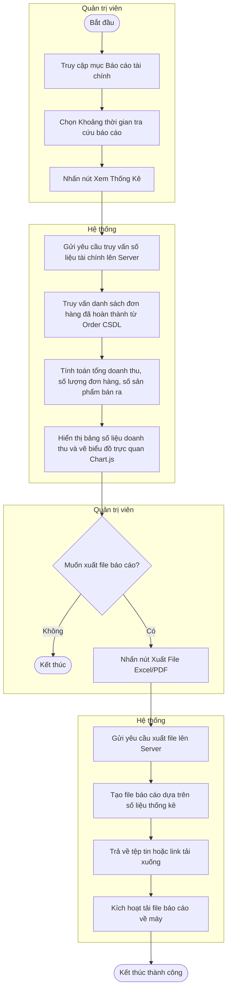
```mermaid
flowchart TD
    subgraph Quản trị viên
        Start7([Bắt đầu]) --> OpenFinance[Truy cập mục Báo cáo tài chính]
        OpenFinance --> SelectFinancePeriod[Chọn Khoảng thời gian tra cứu báo cáo]
        SelectFinancePeriod --> ClickGetFinance[Nhấn nút Xem Thống Kê]
    end
    subgraph Hệ thống
        ClickGetFinance --> SendFinanceReq[Gửi yêu cầu truy vấn số liệu tài chính lên Server]
        SendFinanceReq --> QueryCompletedOrders[Truy vấn danh sách đơn hàng đã hoàn thành từ Order CSDL]
        QueryCompletedOrders --> AggregateFinanceData[Tính toán tổng doanh thu, số lượng đơn hàng, số sản phẩm bán ra]
        AggregateFinanceData --> DisplayFinanceUI[Hiển thị bảng số liệu doanh thu và vẽ biểu đồ trực quan Chart.js]
    end
    subgraph Quản trị viên
        DisplayFinanceUI --> CheckExportFile{Muốn xuất file báo cáo?}
        CheckExportFile -- Không --> EndFinanceView([Kết thúc])
        CheckExportFile -- Có --> ClickExportFinance[Nhấn nút Xuất File Excel/PDF]
    end
    subgraph Hệ thống
        ClickExportFinance --> SendExportReq[Gửi yêu cầu xuất file lên Server]
        SendExportReq --> CreateReportDoc[Tạo file báo cáo dựa trên số liệu thống kê]
        CreateReportDoc --> ReturnDownloadLink[Trả về tệp tin hoặc link tải xuống]
        ReturnDownloadLink --> TriggerDownload[Kích hoạt tải file báo cáo về máy]
    end
    TriggerDownload --> EndSuccess7([Kết thúc thành công])
```

---

## 8. QUẢN LÝ KHIẾU NẠI CỦA KHÁCH HÀNG (CUSTOMER COMPLAINT MANAGEMENT)

### 8.1. Biểu đồ tuần tự
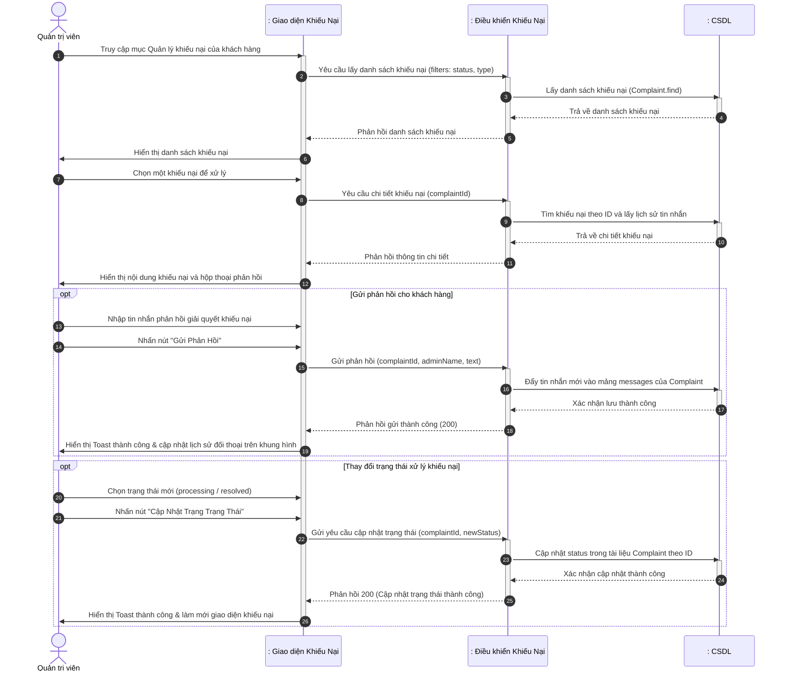
```mermaid
sequenceDiagram
    autonumber
    actor Admin as Quản trị viên
    participant ComplaintUI as : Giao diện Khiếu Nại
    participant ComplaintCtrl as : Điều khiển Khiếu Nại
    participant DB as : CSDL

    Admin ->> ComplaintUI: Truy cập mục Quản lý khiếu nại của khách hàng
    activate ComplaintUI
    ComplaintUI ->> ComplaintCtrl: Yêu cầu lấy danh sách khiếu nại (filters: status, type)
    activate ComplaintCtrl
    ComplaintCtrl ->> DB: Lấy danh sách khiếu nại (Complaint.find)
    activate DB
    DB -->> ComplaintCtrl: Trả về danh sách khiếu nại
    deactivate DB
    ComplaintCtrl -->> ComplaintUI: Phản hồi danh sách khiếu nại
    deactivate ComplaintCtrl
    ComplaintUI ->> Admin: Hiển thị danh sách khiếu nại

    Admin ->> ComplaintUI: Chọn một khiếu nại để xử lý
    ComplaintUI ->> ComplaintCtrl: Yêu cầu chi tiết khiếu nại (complaintId)
    activate ComplaintCtrl
    ComplaintCtrl ->> DB: Tìm khiếu nại theo ID và lấy lịch sử tin nhắn
    activate DB
    DB -->> ComplaintCtrl: Trả về chi tiết khiếu nại
    deactivate DB
    ComplaintCtrl -->> ComplaintUI: Phản hồi thông tin chi tiết
    deactivate ComplaintCtrl
    ComplaintUI ->> Admin: Hiển thị nội dung khiếu nại và hộp thoại phản hồi

    opt Gửi phản hồi cho khách hàng
        Admin ->> ComplaintUI: Nhập tin nhắn phản hồi giải quyết khiếu nại
        Admin ->> ComplaintUI: Nhấn nút "Gửi Phản Hồi"
        ComplaintUI ->> ComplaintCtrl: Gửi phản hồi (complaintId, adminName, text)
        activate ComplaintCtrl
        ComplaintCtrl ->> DB: Đẩy tin nhắn mới vào mảng messages của Complaint
        activate DB
        DB -->> ComplaintCtrl: Xác nhận lưu thành công
        deactivate DB
        ComplaintCtrl -->> ComplaintUI: Phản hồi gửi thành công (200)
        deactivate ComplaintCtrl
        ComplaintUI ->> Admin: Hiển thị Toast thành công & cập nhật lịch sử đối thoại trên khung hình
    end

    opt Thay đổi trạng thái xử lý khiếu nại
        Admin ->> ComplaintUI: Chọn trạng thái mới (processing / resolved)
        Admin ->> ComplaintUI: Nhấn nút "Cập Nhật Trạng Trạng Thái"
        ComplaintUI ->> ComplaintCtrl: Gửi yêu cầu cập nhật trạng thái (complaintId, newStatus)
        activate ComplaintCtrl
        ComplaintCtrl ->> DB: Cập nhật status trong tài liệu Complaint theo ID
        activate DB
        DB -->> ComplaintCtrl: Xác nhận cập nhật thành công
        deactivate DB
        ComplaintCtrl -->> ComplaintUI: Phản hồi 200 (Cập nhật trạng thái thành công)
        deactivate ComplaintCtrl
        ComplaintUI ->> Admin: Hiển thị Toast thành công & làm mới giao diện khiếu nại
    end
    deactivate ComplaintUI
```

### 8.2. Biểu đồ hoạt động
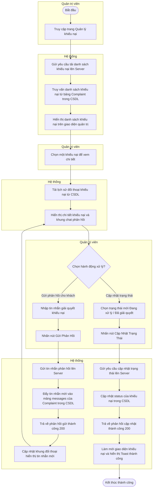
```mermaid
flowchart TD
    subgraph Quản trị viên
        Start8([Bắt đầu]) --> OpenComplaints[Truy cập trang Quản lý khiếu nại]
    end
    subgraph Hệ thống
        OpenComplaints --> LoadComplaints[Gửi yêu cầu tải danh sách khiếu nại lên Server]
        LoadComplaints --> QueryComplaintsDB[Truy vấn danh sách khiếu nại từ bảng Complaint trong CSDL]
        QueryComplaintsDB --> DisplayComplaints[Hiển thị danh sách khiếu nại trên giao diện quản trị]
    end
    subgraph Quản trị viên
        DisplayComplaints --> SelectComplaint[Chọn một khiếu nại để xem chi tiết]
    end
    subgraph Hệ thống
        SelectComplaint --> LoadComplaintDetails[Tải lịch sử đối thoại khiếu nại từ CSDL]
        LoadComplaintDetails --> DisplayComplaintWorkspace[Hiển thị chi tiết khiếu nại và khung chat phản hồi]
    end
    subgraph Quản trị viên
        DisplayComplaintWorkspace --> ChooseComplaintAction{Chọn hành động xử lý?}
        
        ChooseComplaintAction -- Gửi phản hồi cho khách --> InputComplaintReply[Nhập tin nhắn giải quyết khiếu nại]
        InputComplaintReply --> ClickSendComplaintReply[Nhấn nút Gửi Phản Hồi]
        
        ChooseComplaintAction -- Cập nhật trạng thái --> SelectComplaintStatus[Chọn trạng thái mới Đang xử lý / Đã giải quyết]
        SelectComplaintStatus --> ClickUpdateComplaintStatus[Nhấn nút Cập Nhật Trạng Thái]
    end
    subgraph Hệ thống
        ClickSendComplaintReply --> SendComplaintReplyAPI[Gửi tin nhắn phản hồi lên Server]
        SendComplaintReplyAPI --> SaveComplaintReplyDB[Đẩy tin nhắn mới vào mảng messages của Complaint trong CSDL]
        SaveComplaintReplyDB --> ReturnComplaintReplyOk[Trả về phản hồi gửi thành công 200]
        ReturnComplaintReplyOk --> RefreshComplaintChatUI[Cập nhật khung đối thoại hiển thị tin nhắn mới]
        
        ClickUpdateComplaintStatus --> SendUpdateComplaintStatus[Gửi yêu cầu cập nhật trạng thái lên Server]
        SendUpdateComplaintStatus --> UpdateComplaintStatusDB[Cập nhật status của khiếu nại trong CSDL]
        UpdateComplaintStatusDB --> ReturnUpdateComplaintStatusOk[Trả về phản hồi cập nhật thành công 200]
        ReturnUpdateComplaintStatusOk --> RefreshComplaintListUI[Làm mới giao diện khiếu nại và hiển thị Toast thành công]
    end
    RefreshComplaintChatUI --> DisplayComplaintWorkspace
    RefreshComplaintListUI --> EndSuccess8([Kết thúc thành công])
```

---

## 9. QUẢN LÝ BÁO CÁO CỦA NHÂN VIÊN (STAFF REPORT/FEEDBACK MANAGEMENT)

### 9.1. Biểu đồ tuần tự
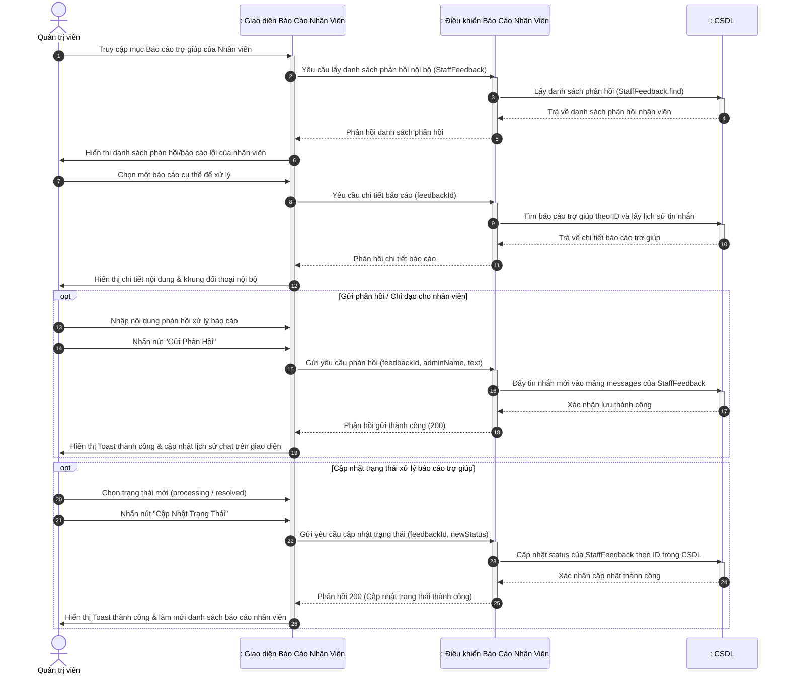
```mermaid
sequenceDiagram
    autonumber
    actor Admin as Quản trị viên
    participant SupportUI as : Giao diện Báo Cáo Nhân Viên
    participant SupportCtrl as : Điều khiển Báo Cáo Nhân Viên
    participant DB as : CSDL

    Admin ->> SupportUI: Truy cập mục Báo cáo trợ giúp của Nhân viên
    activate SupportUI
    SupportUI ->> SupportCtrl: Yêu cầu lấy danh sách phản hồi nội bộ (StaffFeedback)
    activate SupportCtrl
    SupportCtrl ->> DB: Lấy danh sách phản hồi (StaffFeedback.find)
    activate DB
    DB -->> SupportCtrl: Trả về danh sách phản hồi nhân viên
    deactivate DB
    SupportCtrl -->> SupportUI: Phản hồi danh sách phản hồi
    deactivate SupportCtrl
    SupportUI ->> Admin: Hiển thị danh sách phản hồi/báo cáo lỗi của nhân viên

    Admin ->> SupportUI: Chọn một báo cáo cụ thể để xử lý
    SupportUI ->> SupportCtrl: Yêu cầu chi tiết báo cáo (feedbackId)
    activate SupportCtrl
    SupportCtrl ->> DB: Tìm báo cáo trợ giúp theo ID và lấy lịch sử tin nhắn
    activate DB
    DB -->> SupportCtrl: Trả về chi tiết báo cáo trợ giúp
    deactivate DB
    SupportCtrl -->> SupportUI: Phản hồi chi tiết báo cáo
    deactivate SupportCtrl
    SupportUI ->> Admin: Hiển thị chi tiết nội dung & khung đối thoại nội bộ

    opt Gửi phản hồi / Chỉ đạo cho nhân viên
        Admin ->> SupportUI: Nhập nội dung phản hồi xử lý báo cáo
        Admin ->> SupportUI: Nhấn nút "Gửi Phản Hồi"
        SupportUI ->> SupportCtrl: Gửi yêu cầu phản hồi (feedbackId, adminName, text)
        activate SupportCtrl
        SupportCtrl ->> DB: Đẩy tin nhắn mới vào mảng messages của StaffFeedback
        activate DB
        DB -->> SupportCtrl: Xác nhận lưu thành công
        deactivate DB
        SupportCtrl -->> SupportUI: Phản hồi gửi thành công (200)
        deactivate SupportCtrl
        SupportUI ->> Admin: Hiển thị Toast thành công & cập nhật lịch sử chat trên giao diện
    end

    opt Cập nhật trạng thái xử lý báo cáo trợ giúp
        Admin ->> SupportUI: Chọn trạng thái mới (processing / resolved)
        Admin ->> SupportUI: Nhấn nút "Cập Nhật Trạng Thái"
        SupportUI ->> SupportCtrl: Gửi yêu cầu cập nhật trạng thái (feedbackId, newStatus)
        activate SupportCtrl
        SupportCtrl ->> DB: Cập nhật status của StaffFeedback theo ID trong CSDL
        activate DB
        DB -->> SupportCtrl: Xác nhận cập nhật thành công
        deactivate DB
        SupportCtrl -->> SupportUI: Phản hồi 200 (Cập nhật trạng thái thành công)
        deactivate SupportCtrl
        SupportUI ->> Admin: Hiển thị Toast thành công & làm mới danh sách báo cáo nhân viên
    end
    deactivate SupportUI
```

### 9.2. Biểu đồ hoạt động
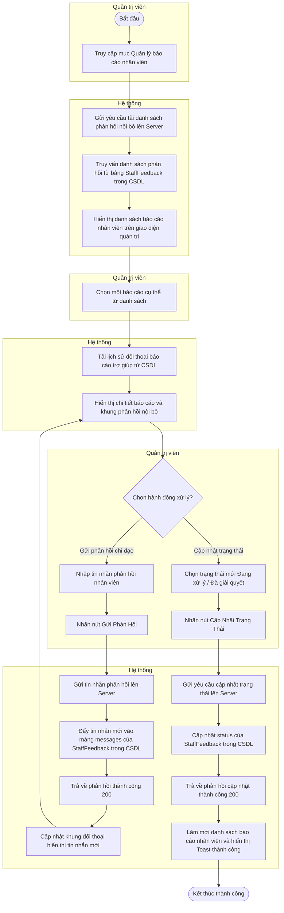
```mermaid
flowchart TD
    subgraph Quản trị viên
        Start9([Bắt đầu]) --> OpenStaffFeedback[Truy cập mục Quản lý báo cáo nhân viên]
    end
    subgraph Hệ thống
        OpenStaffFeedback --> LoadStaffFeedback[Gửi yêu cầu tải danh sách phản hồi nội bộ lên Server]
        LoadStaffFeedback --> QueryStaffFeedbackDB[Truy vấn danh sách phản hồi từ bảng StaffFeedback trong CSDL]
        QueryStaffFeedbackDB --> DisplayStaffFeedback[Hiển thị danh sách báo cáo nhân viên trên giao diện quản trị]
    end
    subgraph Quản trị viên
        DisplayStaffFeedback --> SelectStaffFeedback[Chọn một báo cáo cụ thể từ danh sách]
    end
    subgraph Hệ thống
        SelectStaffFeedback --> LoadStaffFeedbackDetails[Tải lịch sử đối thoại báo cáo trợ giúp từ CSDL]
        LoadStaffFeedbackDetails --> DisplayStaffFeedbackWorkspace[Hiển thị chi tiết báo cáo và khung phản hồi nội bộ]
    end
    subgraph Quản trị viên
        DisplayStaffFeedbackWorkspace --> ChooseStaffFeedbackAction{Chọn hành động xử lý?}
        
        ChooseStaffFeedbackAction -- Gửi phản hồi chỉ đạo --> InputStaffFeedbackReply[Nhập tin nhắn phản hồi nhân viên]
        InputStaffFeedbackReply --> ClickSendStaffFeedbackReply[Nhấn nút Gửi Phản Hồi]
        
        ChooseStaffFeedbackAction -- Cập nhật trạng thái --> SelectStaffFeedbackStatus[Chọn trạng thái mới Đang xử lý / Đã giải quyết]
        SelectStaffFeedbackStatus --> ClickUpdateStaffFeedbackStatus[Nhấn nút Cập Nhật Trạng Thái]
    end
    subgraph Hệ thống
        ClickSendStaffFeedbackReply --> SendStaffFeedbackReplyAPI[Gửi tin nhắn phản hồi lên Server]
        SendStaffFeedbackReplyAPI --> SaveStaffFeedbackReplyDB[Đẩy tin nhắn mới vào mảng messages của StaffFeedback trong CSDL]
        SaveStaffFeedbackReplyDB --> ReturnStaffFeedbackReplyOk[Trả về phản hồi thành công 200]
        ReturnStaffFeedbackReplyOk --> RefreshStaffFeedbackChatUI[Cập nhật khung đối thoại hiển thị tin nhắn mới]
        
        ClickUpdateStaffFeedbackStatus --> SendUpdateStaffFeedbackStatus[Gửi yêu cầu cập nhật trạng thái lên Server]
        SendUpdateStaffFeedbackStatus --> UpdateStaffFeedbackStatusDB[Cập nhật status của StaffFeedback trong CSDL]
        UpdateStaffFeedbackStatusDB --> ReturnUpdateStaffFeedbackStatusOk[Trả về phản hồi cập nhật thành công 200]
        ReturnUpdateStaffFeedbackStatusOk --> RefreshStaffFeedbackListUI[Làm mới danh sách báo cáo nhân viên và hiển thị Toast thành công]
    end
    RefreshStaffFeedbackChatUI --> DisplayStaffFeedbackWorkspace
    RefreshStaffFeedbackListUI --> EndSuccess9([Kết thúc thành công])
```

---

## 10. QUẢN LÝ ĐƠN HÀNG (ORDER MANAGEMENT)

### 10.1. Biểu đồ tuần tự
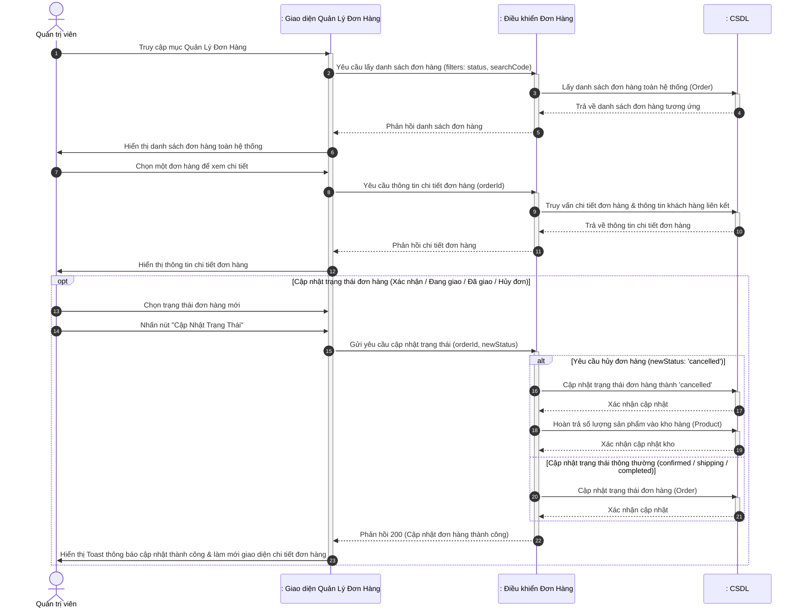
```mermaid
sequenceDiagram
    autonumber
    actor Admin as Quản trị viên
    participant OrderUI as : Giao diện Quản Lý Đơn Hàng
    participant OrderCtrl as : Điều khiển Đơn Hàng
    participant DB as : CSDL

    Admin ->> OrderUI: Truy cập mục Quản Lý Đơn Hàng
    activate OrderUI
    OrderUI ->> OrderCtrl: Yêu cầu lấy danh sách đơn hàng (filters: status, searchCode)
    activate OrderCtrl
    OrderCtrl ->> DB: Lấy danh sách đơn hàng toàn hệ thống (Order)
    activate DB
    DB -->> OrderCtrl: Trả về danh sách đơn hàng tương ứng
    deactivate DB
    OrderCtrl -->> OrderUI: Phản hồi danh sách đơn hàng
    deactivate OrderCtrl
    OrderUI ->> Admin: Hiển thị danh sách đơn hàng toàn hệ thống

    Admin ->> OrderUI: Chọn một đơn hàng để xem chi tiết
    OrderUI ->> OrderCtrl: Yêu cầu thông tin chi tiết đơn hàng (orderId)
    activate OrderCtrl
    OrderCtrl ->> DB: Truy vấn chi tiết đơn hàng & thông tin khách hàng liên kết
    activate DB
    DB -->> OrderCtrl: Trả về thông tin chi tiết đơn hàng
    deactivate DB
    OrderCtrl -->> OrderUI: Phản hồi chi tiết đơn hàng
    deactivate OrderCtrl
    OrderUI ->> Admin: Hiển thị thông tin chi tiết đơn hàng

    opt Cập nhật trạng thái đơn hàng (Xác nhận / Đang giao / Đã giao / Hủy đơn)
        Admin ->> OrderUI: Chọn trạng thái đơn hàng mới
        Admin ->> OrderUI: Nhấn nút "Cập Nhật Trạng Thái"
        OrderUI ->> OrderCtrl: Gửi yêu cầu cập nhật trạng thái (orderId, newStatus)
        activate OrderCtrl
        
        alt Yêu cầu hủy đơn hàng (newStatus: 'cancelled')
            OrderCtrl ->> DB: Cập nhật trạng thái đơn hàng thành 'cancelled'
            activate DB
            DB -->> OrderCtrl: Xác nhận cập nhật
            deactivate DB
            OrderCtrl ->> DB: Hoàn trả số lượng sản phẩm vào kho hàng (Product)
            activate DB
            DB -->> OrderCtrl: Xác nhận cập nhật kho
            deactivate DB
        else Cập nhật trạng thái thông thường (confirmed / shipping / completed)
            OrderCtrl ->> DB: Cập nhật trạng thái đơn hàng (Order)
            activate DB
            DB -->> OrderCtrl: Xác nhận cập nhật
            deactivate DB
        end
        
        OrderCtrl -->> OrderUI: Phản hồi 200 (Cập nhật đơn hàng thành công)
        deactivate OrderCtrl
        OrderUI ->> Admin: Hiển thị Toast thông báo cập nhật thành công & làm mới giao diện chi tiết đơn hàng
    end
    deactivate OrderUI
```

### 10.2. Biểu đồ hoạt động
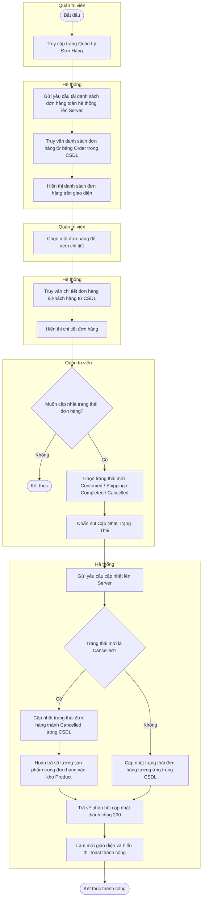
```mermaid
flowchart TD
    subgraph Quản trị viên
        Start10([Bắt đầu]) --> OpenOrdersAdmin[Truy cập trang Quản Lý Đơn Hàng]
    end
    subgraph Hệ thống
        OpenOrdersAdmin --> RequestOrdersAll[Gửi yêu cầu tải danh sách đơn hàng toàn hệ thống lên Server]
        RequestOrdersAll --> QueryOrdersAll[Truy vấn danh sách đơn hàng từ bảng Order trong CSDL]
        QueryOrdersAll --> DisplayOrdersAll[Hiển thị danh sách đơn hàng trên giao diện]
    end
    subgraph Quản trị viên
        DisplayOrdersAll --> SelectOrderAdmin[Chọn một đơn hàng để xem chi tiết]
    end
    subgraph Hệ thống
        SelectOrderAdmin --> QueryOrderDetailAdmin[Truy vấn chi tiết đơn hàng & khách hàng từ CSDL]
        QueryOrderDetailAdmin --> ShowOrderDetailAdmin[Hiển thị chi tiết đơn hàng]
    end
    subgraph Quản trị viên
        ShowOrderDetailAdmin --> WantUpdateOrderAdmin{Muốn cập nhật trạng thái đơn hàng?}
        WantUpdateOrderAdmin -- Không --> EndNoUpdateAdmin([Kết thúc])
        WantUpdateOrderAdmin -- Có --> SelectNewStatusAdmin[Chọn trạng thái mới Confirmed / Shipping / Completed / Cancelled]
        SelectNewStatusAdmin --> ClickUpdateOrderAdmin[Nhấn nút Cập Nhật Trạng Thái]
    end
    subgraph Hệ thống
        ClickUpdateOrderAdmin --> SendUpdateOrderAdmin[Gửi yêu cầu cập nhật lên Server]
        SendUpdateOrderAdmin --> CheckStatusCancelledAdmin{Trạng thái mới là Cancelled?}
        CheckStatusCancelledAdmin -- Có --> CancelOrderDBAdmin[Cập nhật trạng thái đơn hàng thành Cancelled trong CSDL]
        CancelOrderDBAdmin --> RestockProductsAdmin[Hoàn trả số lượng sản phẩm trong đơn hàng vào kho Product]
        CheckStatusCancelledAdmin -- Không --> UpdateOrderStatusDBAdmin[Cập nhật trạng thái đơn hàng tương ứng trong CSDL]
        RestockProductsAdmin --> ReturnUpdateSuccessAdmin[Trả về phản hồi cập nhật thành công 200]
        UpdateOrderStatusDBAdmin --> ReturnUpdateSuccessAdmin
        ReturnUpdateSuccessAdmin --> RefreshOrderDetailUIAdmin[Làm mới giao diện và hiển thị Toast thành công]
    end
    RefreshOrderDetailUIAdmin --> EndSuccess10([Kết thúc thành công])
```

---

## 11. CÀI ĐẶT HỆ THỐNG (SYSTEM SETTINGS)

### 11.1. Biểu đồ tuần tự
```mermaid
sequenceDiagram
    autonumber
    actor Admin as Quản trị viên
    participant SettingsUI as : Giao diện Cài Đặt
    participant SettingsCtrl as : Điều khiển Cài Đặt
    participant DB as : CSDL

    Admin ->> SettingsUI: Truy cập trang Cài đặt hệ thống
    activate SettingsUI
    SettingsUI ->> SettingsCtrl: Yêu cầu lấy cấu hình hệ thống hiện tại
    activate SettingsCtrl
    SettingsCtrl ->> DB: Lấy các tham số cấu hình (Setting.find)
    activate DB
    DB -->> SettingsCtrl: Trả về danh sách cài đặt (màu sắc, thông tin sao lưu...)
    deactivate DB
    SettingsCtrl -->> SettingsUI: Phản hồi danh sách cài đặt
    deactivate SettingsCtrl
    SettingsUI ->> Admin: Hiển thị các bảng cấu hình hệ thống

    opt Thiết lập màu sắc hệ thống (Theme Color)
        Admin ->> SettingsUI: Chọn màu chủ đạo (primaryColor) và màu phụ (secondaryColor)
        Admin ->> SettingsUI: Nhấn nút "Lưu Cấu Hình Màu"
        SettingsUI ->> SettingsCtrl: Gửi yêu cầu cập nhật màu (colors: {primary, secondary})
        activate SettingsCtrl
        SettingsCtrl ->> DB: Lưu/Cập nhật khóa 'system_theme_colors' vào bảng Setting
        activate DB
        DB -->> SettingsCtrl: Xác nhận cập nhật thành công
        deactivate DB
        SettingsCtrl -->> SettingsUI: Phản hồi 200 (Cập nhật màu thành công)
        deactivate SettingsCtrl
        SettingsUI ->> SettingsUI: Áp dụng màu sắc mới lên giao diện (CSS custom properties)
        SettingsUI ->> Admin: Hiển thị Toast thông báo cập nhật màu thành công
    end

    opt Sao lưu dữ liệu (Database Backup)
        Admin ->> SettingsUI: Nhấp chọn nút "Sao Lưu Dữ Liệu"
        SettingsUI ->> SettingsCtrl: Gọi API thực hiện sao lưu (POST /api/settings/backup)
        activate SettingsCtrl
        SettingsCtrl ->> SettingsCtrl: Khởi tạo quy trình sao lưu (mongodump hoặc kết xuất file JSON)
        SettingsCtrl ->> DB: Lưu thông tin lịch sử sao lưu (file path, timestamp) vào bảng Setting
        activate DB
        DB -->> SettingsCtrl: Xác nhận lưu thành công
        deactivate DB
        SettingsCtrl -->> SettingsUI: Phản hồi 200 (Sao lưu dữ liệu thành công)
        deactivate SettingsCtrl
        SettingsUI ->> Admin: Hiển thị Toast thành công & cập nhật danh sách các bản sao lưu
    end

    opt Khôi phục dữ liệu (Database Restore)
        Admin ->> SettingsUI: Chọn bản sao lưu từ danh sách hoặc tải file sao lưu lên
        Admin ->> SettingsUI: Nhấn nút "Khôi Phục Dữ Liệu"
        SettingsUI ->> Admin: Hiển thị cảnh báo nguy cơ ghi đè dữ liệu hiện tại
        Admin ->> SettingsUI: Xác nhận "Đồng ý khôi phục"
        SettingsUI ->> SettingsCtrl: Gửi yêu cầu khôi phục dữ liệu (POST /api/settings/restore, backupId)
        activate SettingsCtrl
        SettingsCtrl ->> SettingsCtrl: Thực thi khôi phục dữ liệu (mongorestore hoặc import file)
        SettingsCtrl ->> DB: Ghi nhận lịch sử khôi phục dữ liệu vào bảng Setting
        activate DB
        DB -->> SettingsCtrl: Xác nhận ghi nhận thành công
        deactivate DB
        SettingsCtrl -->> SettingsUI: Phản hồi 200 (Khôi phục dữ liệu thành công)
        deactivate SettingsCtrl
        SettingsUI ->> Admin: Hiển thị Toast thành công & tự động tải lại (Reload) trang web
    end
    deactivate SettingsUI
```

### 11.2. Biểu đồ hoạt động
```mermaid
flowchart TD
    subgraph Quản trị viên
        Start11([Bắt đầu]) --> OpenSettings[Truy cập trang Cài đặt hệ thống]
    end
    subgraph Hệ thống
        OpenSettings --> LoadSettings[Tải các cấu hình hiện tại từ CSDL bảng Setting]
        LoadSettings --> DisplaySettingsForm[Hiển thị giao diện cấu hình màu sắc, sao lưu, khôi phục]
    end
    subgraph Quản trị viên
        DisplaySettingsForm --> ChooseSettingsAction{Chọn hành động cấu hình?}
        
        ChooseSettingsAction -- Thay đổi màu hệ thống --> SelectThemeColors[Chọn bảng màu chủ đạo & màu phụ mới]
        SelectThemeColors --> ClickSaveColors[Nhấn nút Lưu Cấu Hình Màu]
        
        ChooseSettingsAction -- Sao lưu dữ liệu (Backup) --> ClickBackup[Nhấn nút Sao Lưu Dữ Liệu]
        
        ChooseSettingsAction -- Khôi phục dữ liệu (Restore) --> SelectBackupVersion[Chọn bản sao lưu cũ trong danh sách]
        SelectBackupVersion --> ClickRestore[Nhấn nút Khôi Phục Dữ Liệu]
        ClickRestore --> ConfirmRestoreWarning[Xác nhận đồng ý trên hộp thoại cảnh báo]
        
        ChooseSettingsAction -- Chỉ xem cài đặt --> EndSettingsView([Kết thúc])
    end
    subgraph Hệ thống
        ClickSaveColors --> SendColorsReq[Gửi yêu cầu lưu màu sắc lên Server]
        SendColorsReq --> SaveColorsDB[Cập nhật bản ghi màu sắc trong Setting CSDL]
        SaveColorsDB --> ReturnColorsOk[Trả về phản hồi cập nhật thành công 200]
        ReturnColorsOk --> ApplyColorsUI[Thay đổi biến CSS hệ thống và hiển thị Toast thành công]
        
        ClickBackup --> SendBackupReq[Gửi yêu cầu sao lưu lên Server]
        SendBackupReq --> ExecDump[Thực thi lệnh mongodump hoặc xuất file dữ liệu]
        ExecDump --> SaveBackupHistory[Lưu lịch sử sao lưu vào CSDL bảng Setting]
        SaveBackupHistory --> ReturnBackupOk[Trả về phản hồi sao lưu thành công 200]
        ReturnBackupOk --> RefreshBackupList[Cập nhật danh sách bản sao lưu và hiển thị Toast thành công]
        
        ConfirmRestoreWarning --> SendRestoreReq[Gửi yêu cầu khôi phục lên Server]
        SendRestoreReq --> ExecRestoreDB[Thực thi lệnh mongorestore hoặc nạp lại dữ liệu]
        ExecRestoreDB --> LogRestoreHistory[Ghi nhận lịch sử khôi phục dữ liệu vào CSDL]
        LogRestoreHistory --> ReturnRestoreOk[Trả về phản hồi khôi phục thành công 200]
        ReturnRestoreOk --> ReloadSettingsUI[Hiển thị Toast thành công và tự động tải lại Reload trang web]
    end
    ApplyColorsUI --> EndSuccess11([Kết thúc thành công])
    RefreshBackupList --> EndSuccess11
    ReloadSettingsUI --> EndSuccess11
```
