# CHƯƠNG 2: PHÂN TÍCH VÀ THIẾT KẾ HỆ THỐNG "HOME BEDDING"

## 2.1 Khái quát về website thương mại điện tử bán chăn ga gối đệm HomeBedding

### 2.1.1 Giới thiệu chung
Dự án **Home Bedding** là một hệ thống website thương mại điện tử hiện đại chuyên doanh các dòng sản phẩm chăn ga gối đệm cao cấp. Trong bối cảnh công nghệ số phát triển mạnh mẽ và nhu cầu cải thiện chất lượng giấc ngủ của người tiêu dùng ngày càng nâng cao, Home Bedding ra đời nhằm mục đích cung cấp một giải pháp mua sắm trực tuyến thuận tiện, toàn diện và tối ưu trải nghiệm người dùng.

Hệ thống được phát triển theo kiến trúc ứng dụng Web hướng dịch vụ, kết hợp giữa sự linh hoạt của phía Client (Sử dụng cấu trúc giao diện HTML5, CSS3, Javascript thuần cho trải nghiệm mượt mà) và sự mạnh mẽ của phía Server (Được xây dựng trên nền tảng Node.js và Express Framework, kết nối cơ sở dữ liệu MongoDB thông qua thư viện Mongoose ODM).

Website Home Bedding không chỉ đơn thuần là một kênh giới thiệu sản phẩm mà là một hệ thống khép kín phục vụ hoạt động vận hành của một cửa hàng chuyên nghiệp. Hệ thống phân chia quyền hạn rõ ràng giữa ba nhóm đối tượng (Tác nhân): **Khách hàng** (người mua sắm và phản hồi), **Nhân viên** (người vận hành đơn hàng, trực ca và tư vấn) và **Quản trị viên (Admin)** (người cấu hình hệ thống, quản lý tài chính, kiểm soát nhân sự và dữ liệu).

### 2.1.2 Quy trình nghiệp vụ hiện tại
Hoạt động nghiệp vụ của cửa hàng Home Bedding xoay quanh 4 quy trình cốt lõi sau:

#### a) Quy trình mua hàng và thanh toán (Bán hàng)
*   **Khách hàng:** Truy cập website, xem thông tin sản phẩm chi tiết (hình ảnh, giá bán, số lượng tồn kho, các đánh giá liên quan). Khách hàng có thể thêm sản phẩm vào giỏ hàng cá nhân, nhập mã coupon khuyến mãi (Promotion), cập nhật sổ địa chỉ nhận hàng và tiến hành đặt hàng.
*   **Hệ thống:** Tiếp nhận yêu cầu đặt hàng, kiểm tra tính hợp lệ của mã giảm giá (áp dụng sản phẩm, số lượng mã còn lại, trạng thái hoạt động) và kiểm tra số lượng tồn kho của từng sản phẩm. Nếu đủ điều kiện, hệ thống tạo đơn hàng mới với trạng thái ban đầu là "Chờ xác nhận" (Pending), trừ bớt số lượng trong kho sản phẩm, cập nhật số lượng mã giảm giá và làm sạch các mặt hàng tương ứng trong giỏ hàng của người dùng.
*   **Thanh toán:** Hệ thống hỗ trợ hai hình thức là thanh toán khi nhận hàng (COD) hoặc tích hợp thanh toán trước.

#### b) Quy trình xử lý đơn hàng của cửa hàng
*   **Nhân viên / Admin:** Đăng nhập vào giao diện quản trị đơn hàng, theo dõi danh sách các đơn hàng mới. 
*   **Cập nhật trạng thái đơn:** Nhân viên chuyển trạng thái đơn hàng theo lộ trình: Chờ xác nhận (Pending) -> Đang xử lý (Processing) -> Đang giao hàng (Shipping) -> Đã giao hàng thành công (Completed).
*   **Quy trình hủy đơn:** Nếu khách hàng yêu cầu hủy đơn (khi đơn chưa ở trạng thái vận chuyển) hoặc nhân viên hủy đơn do khách không liên lạc được, hệ thống sẽ chuyển đơn hàng sang trạng thái "Đã hủy" (Cancelled) đồng thời tự động hoàn trả số lượng sản phẩm tương ứng trở lại kho hàng để tiếp tục bán cho khách hàng khác.

#### c) Quy trình quản lý ca trực, chấm công và tính lương nhân viên
*   **Đăng ký ca trực:** Hàng tuần, Nhân viên thực hiện gửi phiếu đăng ký ca trực (Sáng, Chiều, Tối) cho tuần tiếp theo.
*   **Phê duyệt ca trực:** Quản trị viên (Admin) xem xét danh sách đăng ký của các nhân viên, thực hiện điều chỉnh nhân sự nếu có xung đột hoặc thiếu người ở các ca trực, sau đó chốt và khóa lịch tuần (Lock Week).
*   **Điểm danh:** Nhân viên đăng nhập vào hệ thống hàng ngày để thực hiện điểm danh ca trực. Hệ thống so khớp thời gian bấm nút chấm công với giờ quy định để tự động ghi nhận trạng thái chấm công (Đúng giờ - present, Muộn - late, hoặc Vắng mặt - absent).
*   **Tính lương:** Cuối tháng, Admin kích hoạt quy trình tính lương. Hệ thống tự động tổng hợp số ca làm việc thực tế của từng nhân viên trong tháng, đối chiếu với lương cơ bản được cấu hình trong hồ sơ của nhân viên đó, áp dụng các khoản phạt đi muộn/nghỉ không phép để xuất ra bảng lương chi tiết và tiến hành xác nhận chi trả lương.

#### d) Quy trình chăm sóc khách hàng và giải quyết khiếu nại
*   **Tư vấn trực tuyến:** Khách hàng có nhu cầu tư vấn sẽ nhấn vào khung chat. Phiên tư vấn được tạo ra ở trạng thái mở (Open). Nhân viên tiếp nhận phiên chat từ màn hình điều khiển để nhắn tin trực tiếp thông qua cơ chế kết nối thời gian thực WebSockets (Socket.io). Khách hàng và nhân viên có thể gửi ảnh đính kèm hoặc gắn kèm mã đơn hàng cần giải quyết. Hệ thống sẽ tự động đóng phiên chat nếu sau 24 giờ không phát sinh tin nhắn mới.
*   **Khiếu nại cửa hàng:** Khách hàng gửi phiếu khiếu nại (Complaints) phân loại theo chủ đề (Thái độ phục vụ, Chất lượng sản phẩm, Lỗi thanh toán, Khác). Admin truy cập danh sách khiếu nại, cập nhật mức độ ưu tiên xử lý (Thấp, Trung bình, Cao), nhắn tin đối thoại trực tiếp để giải quyết và cập nhật trạng thái khiếu nại từ Chờ xử lý (Pending) -> Đang xử lý (Processing) -> Đã giải quyết (Resolved).

### 2.1.3 Dữ liệu và biểu mẫu liên quan
Hệ thống sử dụng các mẫu cấu trúc dữ liệu lưu trữ dưới dạng các Collection (bảng) trong cơ sở dữ liệu MongoDB:

*   **Thông tin Người dùng (User):** Lưu trữ thông tin cá nhân bao gồm Họ tên, Email, Số điện thoại, Mật khẩu đã mã hóa (bcryptjs), Vai trò (customer, staff, admin), Lương cơ bản (`baseSalary`), Sổ địa chỉ giao hàng (`addresses`), Danh sách sản phẩm yêu thích (`wishlist`).
*   **Thông tin Sản phẩm (Product):** Lưu trữ thông tin Tên sản phẩm, Giá bán, Danh mục (Theo các mùa: Xuân, Hạ, Thu, Đông), Số lượng kho hàng (`quantity`), Đường dẫn hình ảnh (`images`), Mô tả sản phẩm (`description`).
*   **Mã Khuyến mãi (Promotion):** Lưu trữ thông tin Tên chương trình, Mã code (Chữ hoa duy nhất), Số tiền giảm giá (`discountAmount`), Số lượng mã còn lại (`quantity`), Các sản phẩm áp dụng và trạng thái kích hoạt (`isActive`).
*   **Đơn đặt hàng (Order):** Lưu trữ thông tin Mã đơn hàng, ID Khách hàng, Tên người nhận, SĐT người nhận, Danh sách sản phẩm mua (Mã SP, Tên SP, Đơn giá, Số lượng), Số tiền giảm giá, Tổng tiền thanh toán, Địa chỉ giao hàng, Trạng thái đơn hàng (pending, processing, shipping, completed, cancelled), Hình thức thanh toán và thời gian tạo.
*   **Yêu cầu ca trực (ShiftRequest):** Lưu trữ thông tin ID Nhân viên, Ngày bắt đầu tuần, Mảng các ca trực đăng ký cụ thể (Ngày, Ca trực: morning, afternoon, evening) và trạng thái duyệt (pending, approved, rejected).
*   **Bảng chấm công (Attendance):** Lưu trữ thông tin ID Nhân viên, Ngày làm việc, Mảng các ca trực được phân công, Trạng thái điểm danh tương ứng cho từng ca (morning, afternoon, evening nhận các giá trị: none, present, absent, late).
*   **Báo cáo khiếu nại (Complaint):** Lưu trữ ID Khách hàng, Tên khách hàng, Loại khiếu nại, Mức độ ưu tiên, Trạng thái giải quyết và Mảng tin nhắn đối thoại giữa Khách hàng và Admin.
*   **Báo cáo lỗi nội bộ (StaffFeedback):** Lưu trữ thông tin ID Nhân viên, Loại báo cáo (Lỗi ca trực, Lỗi lương, Môi trường làm việc, Khác), Mức độ ưu tiên, Trạng thái giải quyết và mảng tin nhắn trao đổi chỉ đạo giữa Nhân viên và Admin.
*   **Cài đặt hệ thống (Setting):** Lưu trữ các tham số cấu hình hệ thống dưới dạng Key - Value như bảng màu giao diện hiện tại (Theme colors), thông tin thời gian sao lưu cơ sở dữ liệu.

---

## 2.2 Phân tích yêu cầu hệ thống

### 2.2.1 Xác định các tác nhân (Actors)
Hệ thống xác định rõ 3 tác nhân chính tham gia vận hành:

1.  **Khách hàng (Customer):** Là tác nhân đại diện cho người mua hàng. Quyền hạn của khách hàng bao gồm: duyệt sản phẩm, tìm kiếm thông tin, quản lý giỏ hàng, áp mã giảm giá, đặt hàng, quản lý thông tin cá nhân và địa chỉ giao hàng, chat trực tiếp với nhân viên tư vấn, đánh giá sản phẩm sau mua hàng, gửi khiếu nại đến ban quản trị cửa hàng.
2.  **Nhân viên (Staff):** Là tác nhân đại diện cho nhân viên vận hành của cửa hàng. Quyền hạn của nhân viên bao gồm: Xem lịch trực tuần, đăng ký ca làm việc cho tuần kế tiếp, thực hiện điểm danh làm việc hàng ngày, tiếp nhận chat hỗ trợ tư vấn cho khách hàng, gửi báo cáo lỗi/khiếu nại nội bộ lên Admin và quản lý cập nhật trạng thái đơn hàng được phân công.
3.  **Quản trị viên (Admin):** Là tác nhân quản trị cấp cao nhất, kiểm soát toàn bộ hoạt động của hệ thống. Quyền hạn của Admin bao gồm: Quản lý danh mục sản phẩm (CRUD), quản lý tài khoản người dùng và phân quyền (CRUD User), thiết lập cấu hình lương cơ bản cho nhân viên, xem bảng lương và chốt thanh toán lương, chốt lịch trực và duyệt ca trực của nhân viên, giải quyết khiếu nại của khách hàng, xem các biểu đồ báo cáo tài chính doanh thu, thiết lập cài đặt hệ thống (thay đổi màu sắc/theme giao diện) và thực hiện sao lưu/khôi phục dữ liệu hệ thống.

### 2.2.2 Danh sách các ca sử dụng (Use Cases)

| STT | Tên ca sử dụng (Use Case) | Tác nhân thực hiện | Mô tả ngắn gọn |
|:---:|:---|:---|:---|
| **1** | Đăng ký tài khoản | Khách hàng | Tạo tài khoản mua hàng mới trên hệ thống. |
| **2** | Đăng nhập hệ thống | Khách hàng, Nhân viên, Admin | Xác thực danh tính người dùng và điều hướng trang tương ứng. |
| **3** | Tìm kiếm & lọc sản phẩm | Khách hàng | Tra cứu sản phẩm theo từ khóa và bộ lọc theo mùa. |
| **4** | Xem chi tiết sản phẩm | Khách hàng | Xem thông tin chi tiết, đánh giá và sản phẩm liên quan. |
| **5** | Quản lý giỏ hàng | Khách hàng | Thêm, cập nhật số lượng, xóa sản phẩm khỏi giỏ hàng. |
| **6** | Đặt hàng & Áp mã giảm giá | Khách hàng | Áp dụng coupon, kiểm tra tồn kho và tạo đơn hàng. |
| **7** | Thêm/Xóa yêu thích | Khách hàng | Quản lý danh sách sản phẩm yêu thích (Wishlist). |
| **8** | Quản lý hồ sơ & sổ địa chỉ | Khách hàng | Cập nhật thông tin cá nhân và danh sách địa chỉ giao hàng. |
| **9** | Tư vấn online (Khách hàng) | Khách hàng | Gửi tin nhắn, đính kèm ảnh/đơn hàng nhờ hỗ trợ. |
| **10**| Đánh giá sản phẩm | Khách hàng | Đánh giá số sao và viết bình luận cho sản phẩm đã mua. |
| **11**| Gửi khiếu nại cửa hàng | Khách hàng | Gửi phản ánh và theo dõi quá trình xử lý của Admin. |
| **12**| Xem & đăng ký lịch trực | Nhân viên | Đăng ký ca làm tuần mới, xem phân công lịch trực. |
| **13**| Điểm danh ca làm | Nhân viên | Chấm công hàng ngày vào các ca được phân công. |
| **14**| Xem bảng lương cá nhân | Nhân viên | Tra cứu bảng lương chi tiết và phản hồi khi có sai sót. |
| **15**| Tư vấn khách hàng (Nhân viên) | Nhân viên | Tiếp nhận phiên chat tư vấn trực tuyến và phản hồi khách. |
| **16**| Báo cáo trợ giúp nội bộ | Nhân viên | Gửi phản hồi, sự cố nội bộ lên cho Admin xử lý. |
| **17**| Quản lý đơn hàng (Staff/Admin) | Nhân viên, Admin | Theo dõi đơn hàng, cập nhật trạng thái xử lý/vận chuyển. |
| **18**| Quản lý người dùng | Admin | CRUD tài khoản khách hàng, nhân viên; gán mã NV. |
| **19**| Quản lý sản phẩm | Admin | CRUD danh mục sản phẩm của website. |
| **20**| Quản lý mã khuyến mãi | Admin | CRUD thông tin và số lượng mã giảm giá trên hệ thống. |
| **21**| Phân công & duyệt ca trực | Admin | Quản lý chấm công nhân viên, duyệt ca đăng ký tuần. |
| **22**| Quản lý bảng lương | Admin | Chốt bảng lương toàn hệ thống và thanh toán lương. |
| **23**| Giải quyết khiếu nại | Admin | Tiếp nhận khiếu nại của khách, trao đổi hướng xử lý. |
| **24**| Giải quyết báo cáo lỗi NV | Admin | Chỉ đạo xử lý và phản hồi phản ánh từ phía nhân viên. |
| **25**| Xem báo cáo tài chính | Admin | Xem biểu đồ thống kê doanh thu, doanh số, xuất Excel. |
| **26**| Thay đổi màu giao diện | Admin | Cấu hình bảng màu hex để đổi theme toàn bộ website. |
| **27**| Sao lưu & Khôi phục | Admin | Thực thi Backup và Restore cơ sở dữ liệu MongoDB. |

### 2.2.3 Sơ đồ Use Case tổng quát
Sơ đồ Use Case tổng quát thể hiện mối quan hệ giữa các tác nhân và toàn bộ chức năng nghiệp vụ của hệ thống **Home Bedding**:

```plantuml
@startuml UseCaseTongQuat
left to right direction
skinparam packageStyle rect

actor "Khách hàng" as Customer
actor "Nhân viên" as Staff
actor "Quản trị viên" as Admin

rectangle "Hệ thống Home Bedding" {
    ' Khách hàng Use Cases
    usecase "Đăng ký tài khoản" as UC_Register
    usecase "Đăng nhập hệ thống" as UC_Login
    usecase "Tìm kiếm & lọc sản phẩm" as UC_Search
    usecase "Xem chi tiết sản phẩm" as UC_ViewDetail
    usecase "Quản lý giỏ hàng" as UC_Cart
    usecase "Đặt hàng & Áp mã giảm giá" as UC_Checkout
    usecase "Quản lý hồ sơ & sổ địa chỉ" as UC_CustProfile
    usecase "Tư vấn online (Khách)" as UC_CustChat
    usecase "Đánh giá sản phẩm" as UC_Review
    usecase "Gửi khiếu nại cửa hàng" as UC_Complaint
    usecase "Thêm/Xóa yêu thích" as UC_Wishlist
    
    ' Nhân viên Use Cases
    usecase "Xem & đăng ký lịch trực" as UC_StaffShift
    usecase "Điểm danh ca làm" as UC_Attendance
    usecase "Xem bảng lương cá nhân" as UC_StaffSalary
    usecase "Tư vấn khách hàng (Nhân viên)" as UC_StaffChat
    usecase "Báo cáo trợ giúp nội bộ" as UC_StaffFeedback
    usecase "Quản lý đơn hàng" as UC_ManageOrder
    
    ' Admin Use Cases
    usecase "Quản lý người dùng" as UC_AdminUsers
    usecase "Quản lý sản phẩm" as UC_AdminProducts
    usecase "Quản lý mã khuyến mãi" as UC_AdminPromos
    usecase "Phân công & duyệt ca trực" as UC_AdminShift
    usecase "Quản lý bảng lương" as UC_AdminSalary
    usecase "Giải quyết khiếu nại" as UC_AdminComplaint
    usecase "Giải quyết báo cáo lỗi NV" as UC_AdminFeedback
    usecase "Xem báo cáo tài chính" as UC_AdminFinance
    usecase "Thay đổi màu giao diện" as UC_AdminTheme
    usecase "Sao lưu & Khôi phục" as UC_BackupRestore
}

' Mối quan hệ Khách hàng
Customer --> UC_Register
Customer --> UC_Login
Customer --> UC_Search
Customer --> UC_ViewDetail
Customer --> UC_Cart
Customer --> UC_Checkout
Customer --> UC_CustProfile
Customer --> UC_CustChat
Customer --> UC_Review
Customer --> UC_Complaint
Customer --> UC_Wishlist

' Mối quan hệ Nhân viên
Staff --> UC_Login
Staff --> UC_StaffShift
Staff --> UC_Attendance
Staff --> UC_StaffSalary
Staff --> UC_StaffChat
Staff --> UC_StaffFeedback
Staff --> UC_ManageOrder
Staff --> UC_CustProfile

' Mối quan hệ Admin
Admin --> UC_Login
Admin --> UC_ManageOrder
Admin --> UC_AdminUsers
Admin --> UC_AdminProducts
Admin --> UC_AdminPromos
Admin --> UC_AdminShift
Admin --> UC_AdminSalary
Admin --> UC_AdminComplaint
Admin --> UC_AdminFeedback
Admin --> UC_AdminFinance
Admin --> UC_AdminTheme
Admin --> UC_BackupRestore

@enduml
```

### 2.2.4 Phân rã Use Case
Để phục vụ việc phân tích chi tiết luồng nghiệp vụ của hệ thống, các ca sử dụng tổng quát sẽ được phân rã thành các sơ đồ chi tiết hơn theo từng tác nhân cụ thể. Dưới đây là các phần phân rã chi tiết.

#### 2.2.4.1 Đối với tác nhân khách hàng
Nhóm các ca sử dụng thuộc về tác nhân Khách hàng tập trung chủ yếu vào chu trình trải nghiệm khách hàng từ khâu tìm hiểu thông tin sản phẩm, quản lý giỏ hàng cá nhân, tiến hành giao dịch thanh toán và cuối cùng là thực hiện các phản hồi sau mua (đánh giá sản phẩm, gửi khiếu nại, chat tư vấn).

Phân hệ này bao gồm các chức năng cốt lõi:
*   **Đăng ký & Đăng nhập tài khoản:** Tạo mới tài khoản khách hàng, đăng nhập nhận JWT Token.
*   **Tìm kiếm & Xem sản phẩm:** Tìm kiếm sản phẩm theo từ khóa, lọc theo mùa, xem chi tiết và sản phẩm liên quan.
*   **Quản lý giỏ hàng:** Thêm sản phẩm vào giỏ, cập nhật số lượng, xóa sản phẩm.
*   **Đặt hàng và Áp dụng Khuyến mãi:** Điền địa chỉ nhận hàng từ sổ địa chỉ, áp mã coupon giảm giá, kiểm tra tồn kho, tạo đơn hàng và thanh toán.
*   **Tương tác & Phản hồi:** Đánh giá sản phẩm đã mua, chat tư vấn trực tuyến với nhân viên hỗ trợ, gửi báo cáo khiếu nại đến Admin.
*   **Quản lý danh sách yêu thích (Wishlist):** Thêm sản phẩm yêu thích để xem lại sau.
*   **Quản lý hồ sơ cá nhân:** Cập nhật thông tin tài khoản và quản lý sổ địa chỉ giao nhận hàng.
