# BÁO CÁO THIẾT KẾ CHI TIẾT - TÁC NHÂN KHÁCH HÀNG (CUSTOMER)

Tài liệu này chứa toàn bộ các biểu đồ thiết kế phân tích hệ thống cho các ca sử dụng thuộc tác nhân **Khách hàng** của website **Home Bedding**.
Các biểu đồ tuần tự được xây dựng nghiêm ngặt theo mô hình **Boundary - Controller - Entity (BCE)**, và các biểu đồ hoạt động mô tả chi tiết logic rẽ nhánh nghiệp vụ.

---

## 1. ĐĂNG KÝ TÀI KHOẢN (REGISTER)

### 1.1. Biểu đồ tuần tự
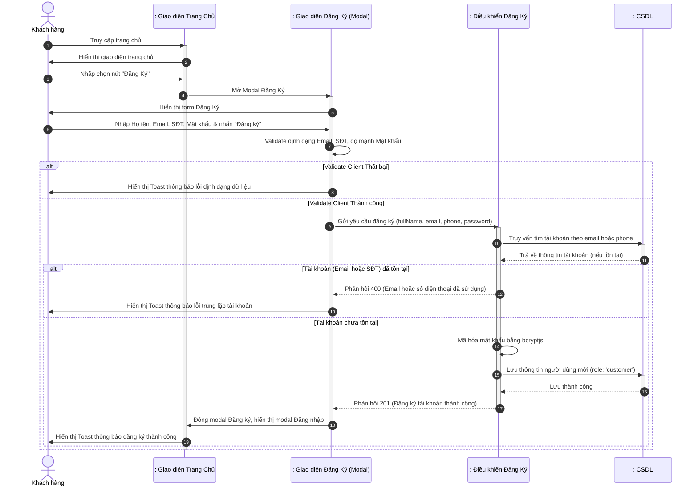

### 1.2. Biểu đồ hoạt động
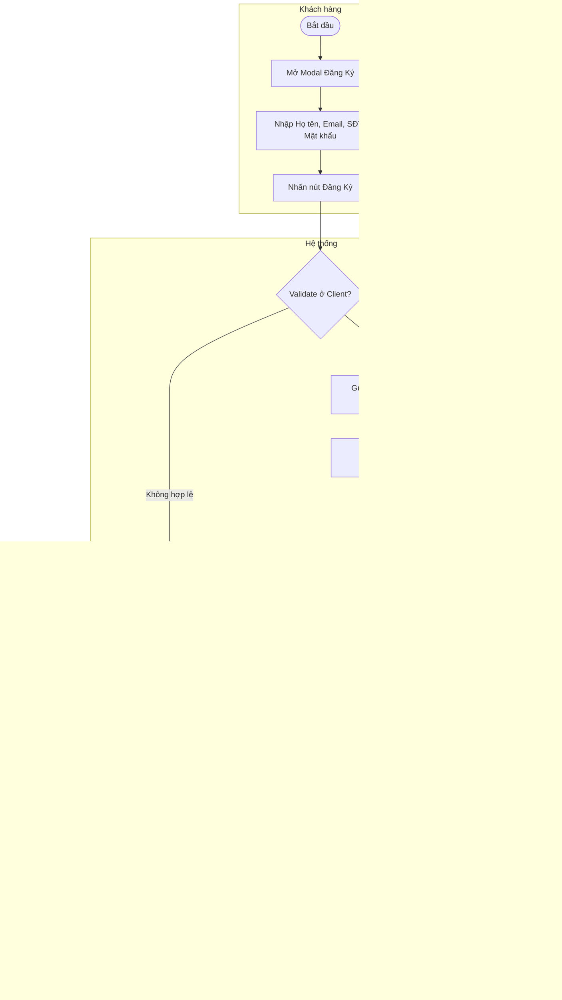

---

## 2. ĐĂNG NHẬP HỆ THỐNG (LOGIN)

### 2.1. Biểu đồ tuần tự
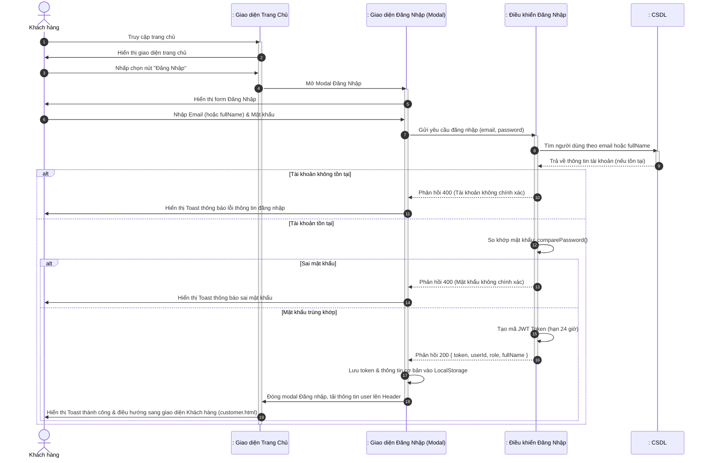

### 2.2. Biểu đồ hoạt động
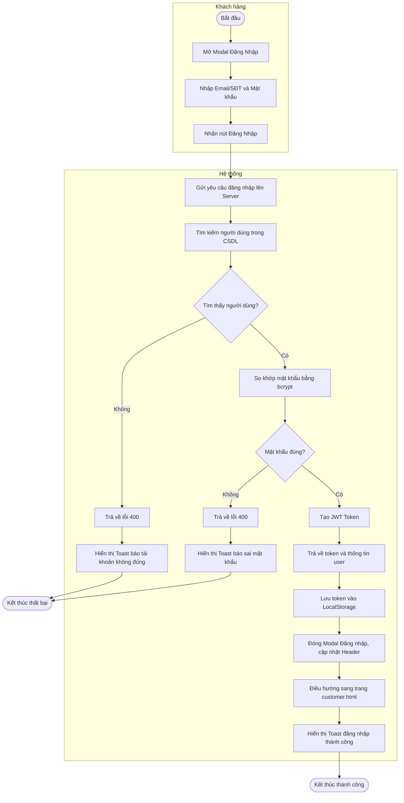

---

## 3. TÌM KIẾM SẢN PHẨM (SEARCH PRODUCT)

### 3.1. Biểu đồ tuần tự
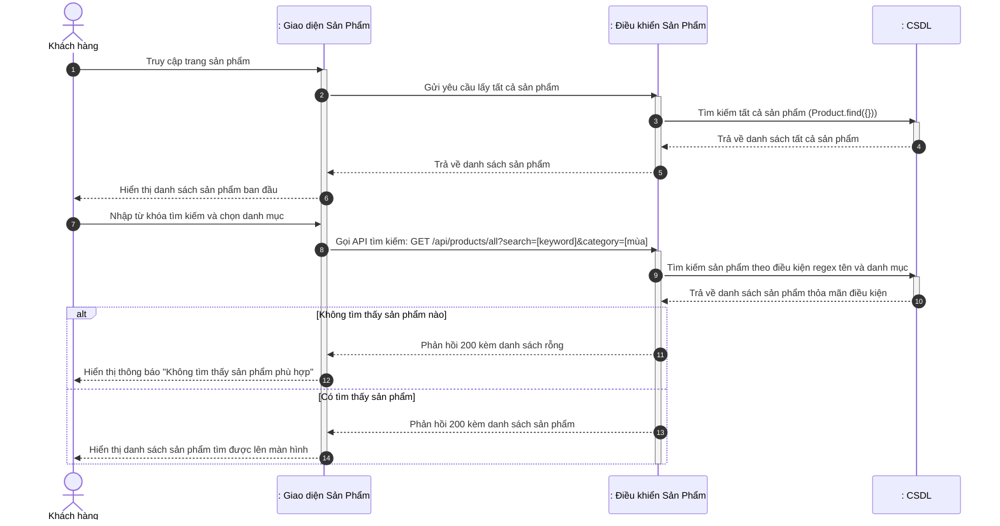

### 3.2. Biểu đồ hoạt động
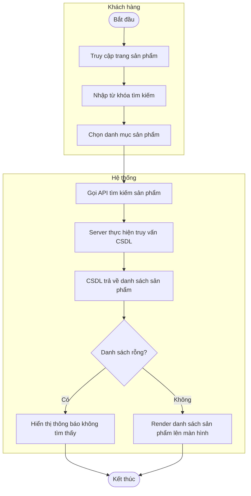

---

## 4. XEM CHI TIẾT SẢN PHẨM (VIEW PRODUCT DETAILS)

### 4.1. Biểu đồ tuần tự
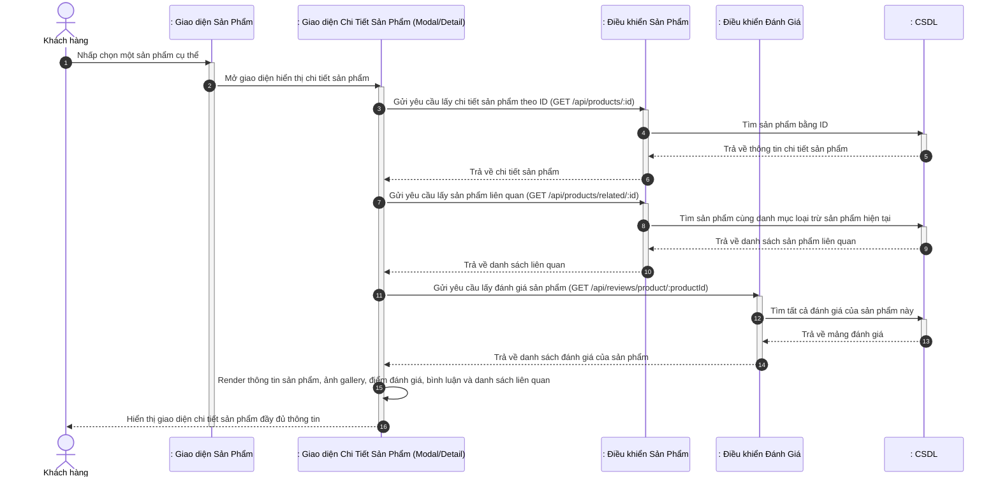

### 4.2. Biểu đồ hoạt động
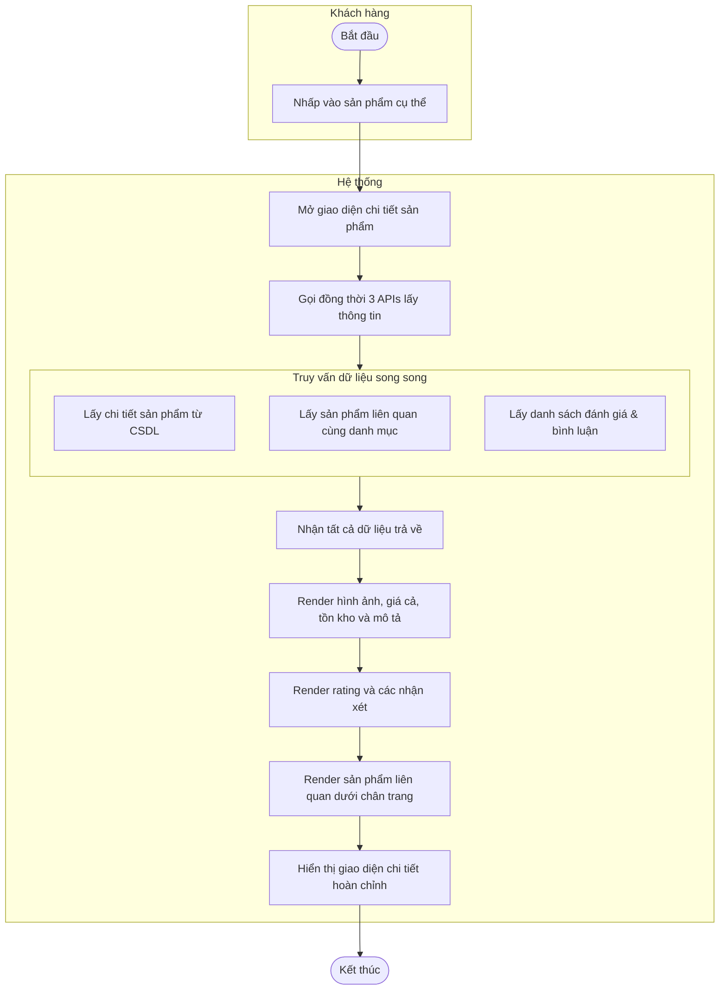

---

## 5. THÊM SẢN PHẨM VÀO GIỎ HÀNG (ADD TO CART)

### 5.1. Biểu đồ tuần tự
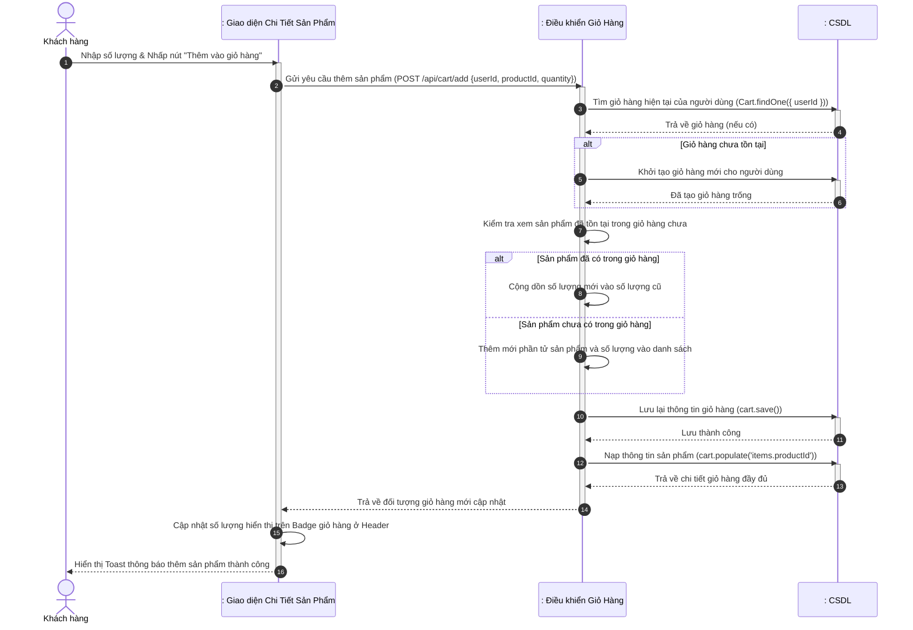

### 5.2. Biểu đồ hoạt động
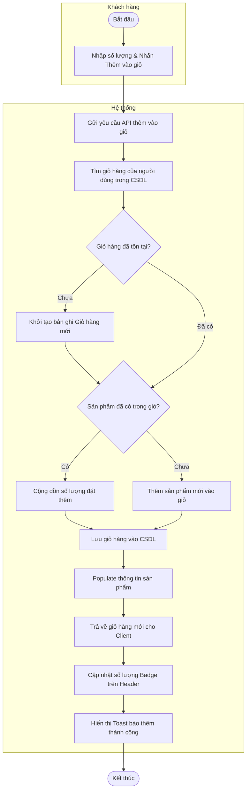

---

## 6. XÓA SẢN PHẨM KHỎI GIỎ HÀNG (DELETE FROM CART)

### 6.1. Biểu đồ tuần tự
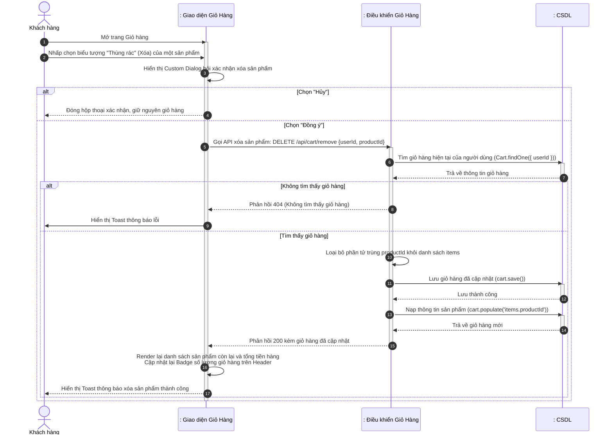

### 6.2. Biểu đồ hoạt động
```mermaid
flowchart TD
    subgraph Khách hàng
        Start6([Bắt đầu]) --> ViewCart[Xem giỏ hàng]
        ViewCart --> ClickDelete[Nhấp biểu tượng xóa trên sản phẩm]
    end
    subgraph Hệ thống
        ClickDelete --> ConfirmDialog[Hiển thị Custom Dialog xác nhận]
        subgraph Lựa chọn
            direction TB
            OptNo[Chọn Hủy] --> CloseDialog[Đóng hộp thoại, giữ nguyên giỏ]
            OptYes[Chọn Đồng ý] --> CallRemoveAPI[Gửi yêu cầu API xóa sản phẩm]
        end
        ConfirmDialog --> Lựa chọn
        CallRemoveAPI --> FindCart[Tìm giỏ hàng trong CSDL]
        FindCart --> CartExist{Giỏ hàng tồn tại?}
        CartExist -- Không --> Return404[Trả về lỗi 404] --> ShowErrToast[Hiển thị Toast thông báo lỗi]
        CartExist -- Có --> FilterItem[Lọc bỏ sản phẩm khỏi danh sách items]
        FilterItem --> SaveDB[Lưu giỏ hàng mới vào CSDL]
        SaveDB --> PopulateDB[Populate lại thông tin sản phẩm]
        PopulateDB --> ReturnDB[Trả về giỏ hàng đã cập nhật]
        ReturnDB --> RenderCart[Client vẽ lại giỏ hàng và Badge ở Header]
        RenderCart --> ShowSuccessToast[Hiển thị Toast xóa thành công]
    end
    CloseDialog --> EndFail6([Kết thúc])
    ShowErrToast  --> EndFail6
    ShowSuccessToast --> EndSuccess6([Kết thúc thành công])
```

---

## 7. TÌM KIẾM TRONG GIỎ HÀNG (SEARCH IN CART)

### 7.1. Biểu đồ tuần tự
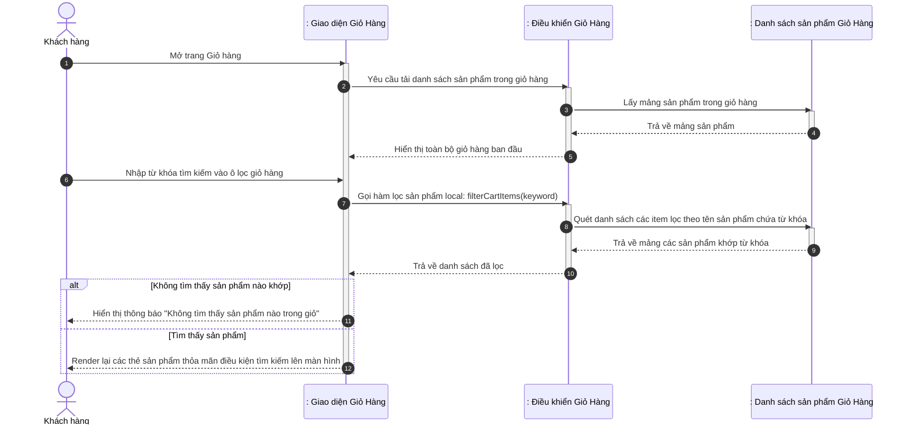

### 7.2. Biểu đồ hoạt động
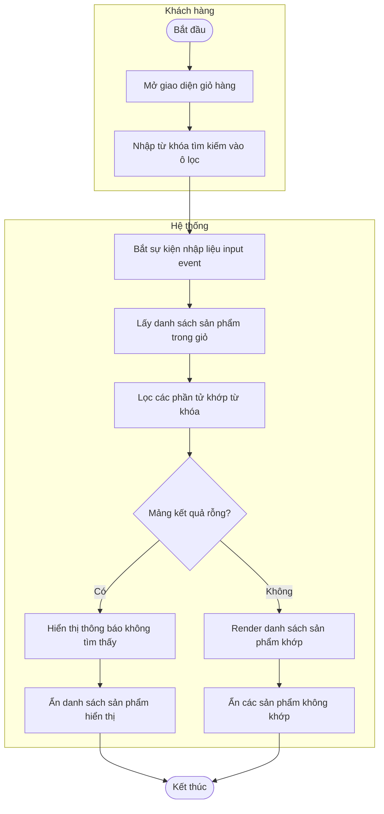

---

## 8. THÊM SẢN PHẨM VÀO YÊU THÍCH (ADD TO WISHLIST)

### 8.1. Biểu đồ tuần tự
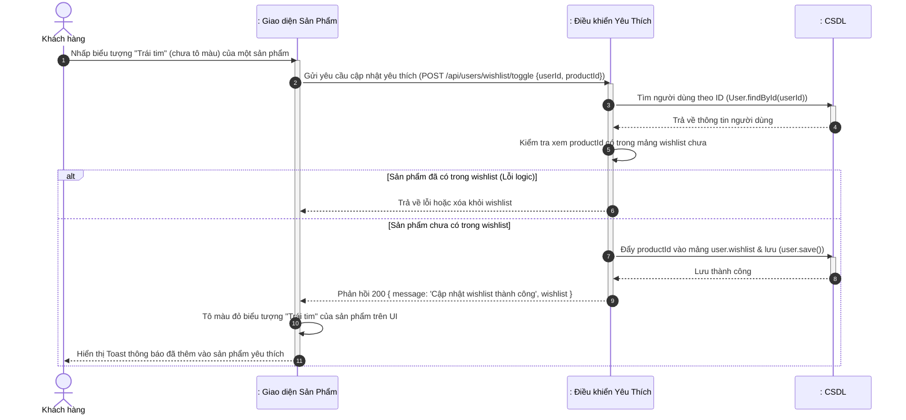

### 8.2. Biểu đồ hoạt động
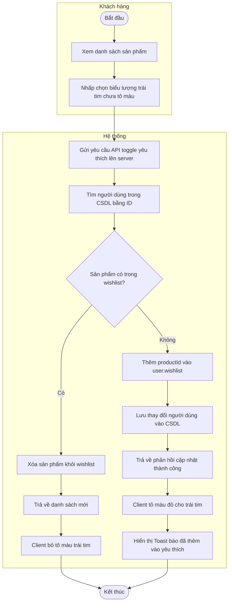

---

## 9. BỎ SẢN PHẨM KHỎI DANH SÁCH YÊU THÍCH (REMOVE FROM WISHLIST)

### 9.1. Biểu đồ tuần tự
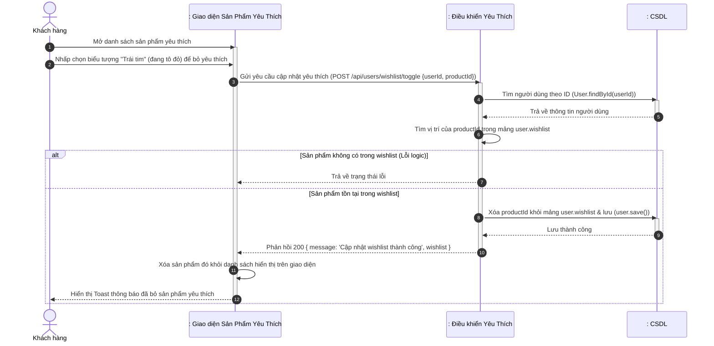

### 9.2. Biểu đồ hoạt động
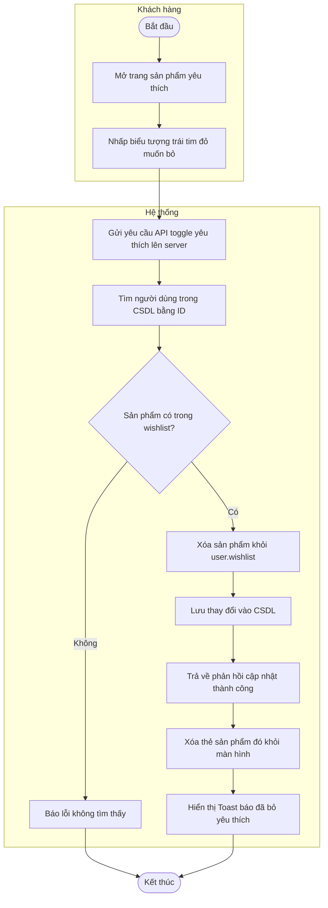

---

## 10. ĐẶT HÀNG (PLACE ORDER)

### 10.1. Biểu đồ tuần tự
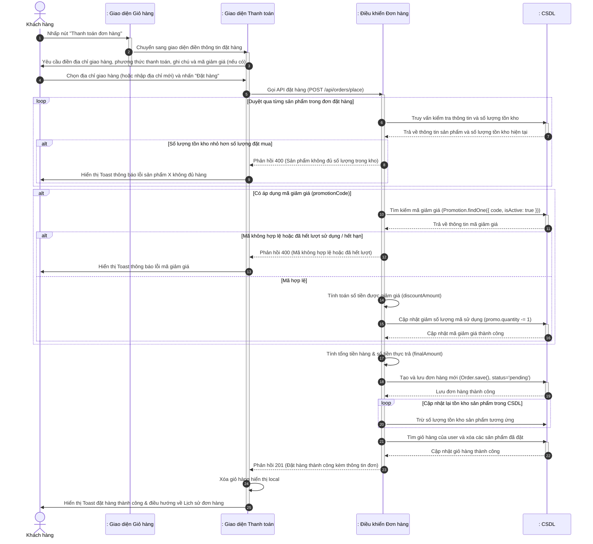

### 10.2. Biểu đồ hoạt động
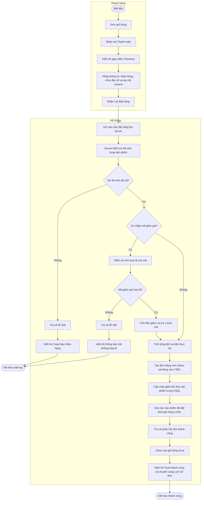

---

## 11. HỦY ĐƠN HÀNG (CANCEL ORDER)

### 11.1. Biểu đồ tuần tự
```mermaid
sequenceDiagram
    autonumber
    actor Customer as Khách hàng
    participant OrdersUI as : Giao diện Lịch Sử Đơn Hàng
    participant OrderCtrl as : Điều khiển Đơn hàng
    participant DB as : CSDL

    Customer ->> OrdersUI: Truy cập trang Lịch sử đơn hàng
    activate OrdersUI
    Customer ->> OrdersUI: Nhấp chọn nút "Hủy đơn" trên một đơn hàng đang chờ xác nhận (pending)
    OrdersUI ->> OrdersUI: Hiển thị Custom Dialog xác nhận hủy đơn
    alt Chọn "Hủy"
        OrdersUI -->> Customer: Đóng hộp thoại xác nhận, giữ nguyên đơn hàng
    else Chọn "Đồng ý"
        OrdersUI ->> OrderCtrl: Gọi API hủy đơn hàng: PUT /api/orders/:orderId/cancel
        activate OrderCtrl
        OrderCtrl ->> DB: Tìm đơn hàng theo ID (Order.findById(orderId))
        activate DB
        DB -->> OrderCtrl: Trả về thông tin đơn hàng
        deactivate DB
        alt Không tìm thấy đơn hàng
            OrderCtrl -->> OrdersUI: Phản hồi 404 (Không tìm thấy đơn hàng)
            OrdersUI ->> Customer: Hiển thị Toast thông báo lỗi
        else Tìm thấy đơn hàng
            alt Trạng thái đơn hàng khác 'pending'
                OrderCtrl -->> OrdersUI: Phản hồi 400 (Chỉ có thể hủy đơn hàng đang chờ xác nhận)
                OrdersUI ->> Customer: Hiển thị Toast báo lỗi không thể hủy đơn
            else Trạng thái đơn hàng là 'pending'
                loop Hoàn lại tồn kho cho từng sản phẩm trong đơn hàng
                    OrderCtrl ->> DB: Cộng lại số lượng tồn kho sản phẩm (quantity + item.quantity)
                end
                OrderCtrl ->> DB: Cập nhật status='cancelled', cancelledBy='Khách hàng', cancelledAt=now
                activate DB
                DB -->> OrderCtrl: Lưu đơn hàng thành công
                deactivate DB
                OrderCtrl -->> OrdersUI: Phản hồi 200 kèm đơn hàng đã cập nhật
                deactivate OrderCtrl
                OrdersUI ->> OrdersUI: Render lại danh sách đơn hàng và trạng thái mới trên UI
                OrdersUI -->> Customer: Hiển thị Toast thông báo hủy đơn hàng thành công
            end
        end
    end
    deactivate OrdersUI
```

### 11.2. Biểu đồ hoạt động
```mermaid
flowchart TD
    subgraph Khách hàng
        Start11([Bắt đầu]) --> ViewOrders[Xem danh sách đơn hàng đã mua]
        ViewOrders --> ClickCancel[Nhấn nút Hủy đơn trên đơn hàng mong muốn]
    end
    subgraph Hệ thống
        ClickCancel --> ShowConfirm[Hiển thị Custom Dialog xác nhận]
        subgraph XacNhan
            direction TB
            OptNo[Hủy] --> CloseDialog[Đóng hộp thoại, giữ nguyên đơn]
            OptYes[Đồng ý] --> CallCancelAPI[Gửi yêu cầu hủy đơn lên server]
        end
        ShowConfirm --> XacNhan
        CallCancelAPI --> FindOrder[Tìm kiếm đơn hàng trong CSDL]
        FindOrder --> OrderExist{Tìm thấy đơn hàng?}
        OrderExist -- Không --> Return404[Trả về lỗi 404] --> Show404Err[Hiển thị Toast báo lỗi không tìm thấy]
        OrderExist -- Có --> StatusCheck{Trạng thái là pending?}
        StatusCheck -- Không --> ReturnStatusErr[Trả về lỗi 400] --> ShowStatusErr[Hiển thị Toast báo chỉ được hủy đơn pending]
        StatusCheck -- Có --> RestoreStock[Duyệt cộng lại số lượng vào kho CSDL]
        RestoreStock --> UpdateStatus[Cập nhật trạng thái thành cancelled, lưu người hủy]
        UpdateStatus --> SaveDB[Lưu thông tin đơn hàng vào CSDL]
        SaveDB --> SuccessRes[Trả về phản hồi 200 thành công]
        SuccessRes --> RenderUI[Client vẽ lại danh sách và trạng thái mới]
        RenderUI --> ShowSuccessToast[Hiển thị Toast báo hủy thành công]
    end
    CloseDialog --> EndFail11([Kết thúc])
    Show404Err --> EndFail11
    ShowStatusErr --> EndFail11
    ShowSuccessToast --> EndSuccess11([Kết thúc thành công])
```

---

## 12. QUẢN LÝ / THEO DÕI ĐƠN HÀNG (MANAGE/TRACK ORDERS)

### 12.1. Biểu đồ tuần tự
```mermaid
sequenceDiagram
    autonumber
    actor Customer as Khách Hàng
    participant HomeUI as : Giao Diện Trang Chủ
    participant TrackingUI as : Giao diện theo dõi đơn hàng
    participant TrackingCtrl as : Điều khiển theo dõi ĐHang
    participant DB as : CSDL

    Customer ->> HomeUI: Truy cập trang chủ
    activate HomeUI
    Customer ->> HomeUI: chọn "Đơn Hàng Của Tôi"
    HomeUI ->> TrackingUI: yêu cầu gửi danh sách đơn hàng
    activate TrackingUI
    TrackingUI --> Customer: Hiển thị Danh sách đơn hàng đã mua
    deactivate HomeUI

    Customer ->> TrackingUI: chọn đơn hàng cần theo dõi
    TrackingUI ->> TrackingCtrl: yêu cầu lấy thông tin vận chuyển
    activate TrackingCtrl
    TrackingCtrl ->> TrackingCtrl: kiểm tra tính hợp lệ của MDH
    TrackingCtrl ->> DB: Truy vấn trạng thái đơn hàng
    activate DB
    DB -->> TrackingCtrl: trả về trạng thái(lịch sử, lịch sử GH)
    deactivate DB

    alt Hợp Lệ
        TrackingCtrl -->> TrackingUI: Gửi thông tin chi tiết VChuyen
        TrackingUI --> Customer: Hiển thị lộ trình Đơn Hàng
    else không tìm thấy/ lỗi hệ thống
        TrackingCtrl -->> TrackingUI: thông báo lỗi
        deactivate TrackingCtrl
        TrackingUI --> Customer: Hiển thị "Khong thể tải TT lúc này"
    end
    deactivate TrackingUI
```

### 12.2. Biểu đồ hoạt động
```mermaid
flowchart TD
    subgraph Khách hàng
        Start12([Bắt đầu]) --> VisitHome[Truy cập trang chủ]
        VisitHome --> ClickMyOrders[Nhấp chọn Đơn Hàng Của Tôi]
    end
    subgraph Hệ thống
        ClickMyOrders --> ShowList[Hiển thị danh sách đơn hàng đã mua]
        ShowList --> SelectOrder[Chọn một đơn hàng cần theo dõi]
        SelectOrder --> SendTrackReq[Gửi yêu cầu lấy thông tin vận chuyển]
        SendTrackReq --> CheckMDH[Kiểm tra tính hợp lệ của mã đơn hàng MDH]
        CheckMDH --> QueryDB[Truy vấn trạng thái đơn hàng từ CSDL]
        QueryDB --> DBReturn[CSDL trả về trạng thái và lịch sử giao hàng]
        DBReturn --> CheckValid{Thông tin hợp lệ và tìm thấy?}
        CheckValid -- Có --> SendDetails[Gửi thông tin chi tiết vận chuyển về UI] --> RenderPath[Hiển thị lộ trình chi tiết của đơn hàng]
        CheckValid -- Không / Lỗi --> SendErr[Phản hồi thông báo lỗi về UI] --> ShowErrUI[Hiển thị thông báo không thể tải thông tin]
    end
    RenderPath --> EndSuccess12([Kết thúc])
    ShowErrUI  --> EndFail12([Kết thúc thất bại])
```

---

## 13. ĐÁNH GIÁ SẢN PHẨM (REVIEW PRODUCT)

### 13.1. Biểu đồ tuần tự
```mermaid
sequenceDiagram
    autonumber
    actor Customer as Khách hàng
    participant OrdersUI as : Giao diện Lịch sử đơn hàng
    participant ReviewUI as : Giao diện Đánh giá (Modal)
    participant ReviewCtrl as : Điều khiển Đánh giá
    participant DB as : CSDL
    participant Disk as Thư mục Uploads

    Customer ->> OrdersUI: Nhấp nút "Viết đánh giá" trên đơn hàng đã hoàn thành (completed)
    activate OrdersUI
    OrdersUI ->> ReviewUI: Mở Modal Đánh giá sản phẩm
    activate ReviewUI
    ReviewUI ->> Customer: Hiển thị form đánh giá (chọn số sao 1-5, nhập bình luận, chọn ảnh tải lên)
    deactivate OrdersUI

    Customer ->> ReviewUI: Chọn số sao, nhập ý kiến & chọn các tệp ảnh -> Gửi
    alt Có chọn tải lên ảnh
        ReviewUI ->> ReviewCtrl: Tải lên các tệp ảnh đánh giá
        activate ReviewCtrl
        ReviewCtrl ->> Disk: Lưu các tệp ảnh vào thư mục /uploads/
        Disk -->> ReviewCtrl: Lưu thành công, trả về danh sách tên file
        ReviewCtrl -->> ReviewUI: Phản hồi 200 kèm các đường dẫn ảnh
        deactivate ReviewCtrl
    end

    ReviewUI ->> ReviewCtrl: Gửi yêu cầu lưu đánh giá (POST /api/reviews/submit)
    activate ReviewCtrl
    ReviewCtrl ->> DB: Kiểm tra xem đã có đánh giá cho sản phẩm thuộc đơn hàng này chưa
    activate DB
    DB -->> ReviewCtrl: Trả về đánh giá cũ (nếu có)
    deactivate DB
    alt Đã tồn tại đánh giá cũ
        ReviewCtrl -->> ReviewUI: Phản hồi 400 (Bạn đã đánh giá sản phẩm này rồi)
        ReviewUI ->> Customer: Hiển thị Toast thông báo lỗi đánh giá trùng
    else Chưa có đánh giá nào trước đó
        ReviewCtrl ->> DB: Tạo mới & lưu Review document
        activate DB
        DB -->> ReviewCtrl: Lưu đánh giá thành công
        deactivate DB
        ReviewCtrl ->> DB: Tính toán lại điểm số trung bình (averageRating) & số lượng review
        activate DB
        DB -->> ReviewCtrl: Trả về điểm trung bình mới
        deactivate DB
        ReviewCtrl ->> DB: Cập nhật averageRating và reviewCount cho Product
        activate DB
        DB -->> ReviewCtrl: Cập nhật sản phẩm thành công
        deactivate DB
        ReviewCtrl -->> ReviewUI: Phản hồi 201 (Đánh giá thành công)
        deactivate ReviewCtrl
        ReviewUI ->> ReviewUI: Đóng modal Đánh giá
        ReviewUI -->> Customer: Hiển thị Toast thông báo gửi đánh giá thành công
    end
    deactivate ReviewUI
```

### 13.2. Biểu đồ hoạt động
```mermaid
flowchart TD
    subgraph Khách hàng
        Start13([Bắt đầu]) --> ViewOrders[Xem danh sách đơn hàng đã mua]
        ViewOrders --> ClickReview[Nhấp chọn Viết đánh giá trên đơn hàng completed]
        ClickReview --> OpenReviewModal[Mở Modal Đánh giá]
        OpenReviewModal --> FillReview[Chọn số sao, viết bình luận, chọn ảnh tải lên]
        FillReview --> ClickSend[Nhấn nút Gửi đánh giá]
    end
    subgraph Hệ thống
        ClickSend --> SendReviewReq[Gửi yêu cầu gửi đánh giá lên server]
        SendReviewReq --> CheckExists[Kiểm tra xem đơn hàng đã được đánh giá chưa]
        CheckExists --> AlreadyReviewed{Đã được đánh giá?}
        AlreadyReviewed -- Có --> ReturnReviewErr[Trả về lỗi 400] --> ShowReviewErr[Hiển thị Toast báo đã đánh giá rồi]
        AlreadyReviewed -- Chưa --> ImageCheck{Có tệp hình ảnh tải kèm?}
        ImageCheck -- Có --> SaveImages[Lưu tệp ảnh vào thư mục upload] --> SaveReview
        ImageCheck -- Không --> SaveReview[Tạo bản ghi Đánh giá mới trong CSDL]
        SaveReview --> CalcRating[Tính điểm trung bình mới của sản phẩm]
        CalcRating --> UpdateProductDB[Cập nhật điểm trung bình & số lượt đánh giá trong CSDL]
        UpdateProductDB --> Return201[Trả về phản hồi 201 thành công]
        Return201 --> CloseReviewModal[Đóng Modal Đánh giá]
        CloseReviewModal --> ShowSuccessToast[Hiển thị Toast gửi đánh giá thành công]
    end
    ShowReviewErr --> EndFail13([Kết thúc thất bại])
    ShowSuccessToast --> EndSuccess13([Kết thúc thành công])
```

---

## 14. TƯ VẤN ONLINE (ONLINE CONSULTATION)

### 14.1. Biểu đồ tuần tự
```mermaid
sequenceDiagram
    autonumber
    actor Customer as Khách hàng
    participant ChatUI as : Giao diện Tư vấn (Chat Panel)
    participant ConsultationCtrl as : Điều khiển Tư vấn
    participant DB as : CSDL
    participant Disk as Thư mục Uploads

    Customer ->> ChatUI: Mở hộp thoại chat hỗ trợ trực tuyến
    activate ChatUI
    ChatUI ->> ConsultationCtrl: Yêu cầu tải lịch sử chat cũ (GET /api/consultations)
    activate ConsultationCtrl
    ConsultationCtrl ->> DB: Tìm phiên chat đang mở hoặc mới nhất của người dùng
    activate DB
    DB -->> ConsultationCtrl: Trả về lịch sử phiên chat (mảng tin nhắn)
    deactivate DB
    ConsultationCtrl -->> ChatUI: Trả về mảng các tin nhắn cũ
    deactivate ConsultationCtrl
    ChatUI -->> Customer: Render tin nhắn cũ lên khung chat

    Customer ->> ChatUI: Nhập tin nhắn mới, có thể đính kèm ảnh hoặc thông tin đơn hàng -> Nhấn "Gửi"
    alt Có chọn tệp ảnh đính kèm
        ChatUI ->> ConsultationCtrl: Tải ảnh đính kèm lên server (POST /api/products/upload)
        activate ConsultationCtrl
        ConsultationCtrl ->> Disk: Lưu tệp ảnh vào thư mục upload
        Disk -->> ConsultationCtrl: Lưu thành công, trả về tên file
        ConsultationCtrl -->> ChatUI: Trả về đường dẫn ảnh
        deactivate ConsultationCtrl
    end

    ChatUI ->> ConsultationCtrl: Gửi tin nhắn mới (POST /api/consultations)
    activate ConsultationCtrl
    ConsultationCtrl ->> DB: Tìm bản ghi Consultation của user có status='open'
    activate DB
    DB -->> ConsultationCtrl: Trả về bản ghi (hoặc null nếu chưa có)
    deactivate DB
    alt Chưa có phiên chat nào đang mở ('open')
        ConsultationCtrl ->> DB: Tạo bản ghi Consultation mới với status='open'
        activate DB
        DB -->> ConsultationCtrl: Đã tạo bản ghi
        deactivate DB
    end

    ConsultationCtrl ->> DB: Đẩy tin nhắn mới của khách hàng vào mảng messages
    activate DB
    DB -->> ConsultationCtrl: Lưu thành công
    deactivate DB
    ConsultationCtrl -->> ChatUI: Phản hồi 200 kèm tin nhắn mới tạo
    deactivate ConsultationCtrl
    ChatUI ->> ChatUI: Render tin nhắn mới lên giao diện chat<br>Cuộn xuống cuối khung chat
    ChatUI -->> Customer: Hoàn thành gửi tin nhắn
    deactivate ChatUI
```

### 14.2. Biểu đồ hoạt động
```mermaid
flowchart TD
    subgraph Khách hàng
        Start14([Bắt đầu]) --> OpenChatPanel[Mở khung chat trực tuyến]
    end
    subgraph Hệ thống
        OpenChatPanel --> CallGetHistory[Gọi API lấy lịch sử tin nhắn cũ]
        CallGetHistory --> QueryChatDB[Server truy vấn CSDL tìm phiên chat]
        QueryChatDB --> RenderHistory[Trả về mảng tin nhắn và render lên khung chat]
    end
    subgraph Khách hàng
        RenderHistory --> EnterNewMessage[Nhập tin nhắn mới, chọn tệp đính kèm]
        EnterNewMessage --> ClickSendMsg[Nhấn nút Gửi]
    end
    subgraph Hệ thống
        ClickSendMsg --> CheckAttachment{Có tệp đính kèm?}
        CheckAttachment -- Có --> UploadImage[Tải hình ảnh lên server] --> GetImagePath[Nhận đường dẫn ảnh] --> SendMsgAPI
        CheckAttachment -- Không --> SendMsgAPI[Gửi yêu cầu lưu tin nhắn mới lên server]
        SendMsgAPI --> FindOpenChat[Tìm phiên chat đang mở open của người dùng]
        FindOpenChat --> OpenChatExist{Đã có phiên chat open?}
        OpenChatExist -- Chưa --> CreateNewChat[Tạo phiên chat Consultation mới] --> AppendMessage
        OpenChatExist -- Có --> AppendMessage[Đẩy tin nhắn mới vào phiên chat CSDL]
        AppendMessage --> SaveChatDB[Lưu phiên chat vào CSDL]
        SaveChatDB --> ReturnSuccessRes[Trả về phản hồi 200 thành công]
        ReturnSuccessRes --> RenderNewMsg[Render tin nhắn mới lên màn hình chat]
        RenderNewMsg --> ScrollChat[Cuộn khung chat xuống dưới cùng]
    end
    ScrollChat --> End14([Kết thúc])
```

---

## 15. KHIẾU NẠI CỬA HÀNG (COMPLAINTS)

### 15.1. Biểu đồ tuần tự
```mermaid
sequenceDiagram
    autonumber
    actor Customer as Khách hàng
    participant ComplaintUI as : Giao diện Khiếu Nại
    participant ComplaintCtrl as : Điều khiển Khiếu Nại
    participant DB as : CSDL

    Customer ->> ComplaintUI: Mở mục "Khiếu nại & Phản hồi"
    activate ComplaintUI
    ComplaintUI ->> ComplaintCtrl: Yêu cầu lấy lịch sử khiếu nại cá nhân (GET /api/complaints/my-complaints/:customerId)
    activate ComplaintCtrl
    ComplaintCtrl ->> DB: Tìm danh sách khiếu nại của khách hàng (Complaint.find({ customerId }))
    activate DB
    DB -->> ComplaintCtrl: Trả về danh sách khiếu nại
    deactivate DB
    ComplaintCtrl -->> ComplaintUI: Trả về danh sách khiếu nại cũ kèm đối thoại xử lý
    deactivate ComplaintCtrl
    ComplaintUI --> Customer: Hiển thị lịch sử khiếu nại lên màn hình

    Customer ->> ComplaintUI: Nhấp nút "Gửi khiếu nại mới"
    ComplaintUI ->> Customer: Hiển thị form điền nội dung khiếu nại
    Customer ->> ComplaintUI: Chọn loại khiếu nại & Nhập mô tả lỗi -> Nhấn "Gửi khiếu nại"
    ComplaintUI ->> ComplaintCtrl: Gọi API tạo khiếu nại (POST /api/complaints)
    activate ComplaintCtrl
    ComplaintCtrl ->> DB: Tạo bản ghi Complaint mới với status='pending', priority='medium'
    activate DB
    DB -->> ComplaintCtrl: Lưu khiếu nại thành công
    deactivate DB
    ComplaintCtrl -->> ComplaintUI: Phản hồi 201 (Thêm khiếu nại thành công)
    deactivate ComplaintCtrl
    ComplaintUI ->> ComplaintUI: Cập nhật thêm khiếu nại mới vào danh sách hiển thị
    ComplaintUI --> Customer: Hiển thị Toast thông báo gửi khiếu nại thành công, vui lòng chờ xử lý
    deactivate ComplaintUI
```

### 15.2. Biểu đồ hoạt động
```mermaid
flowchart TD
    subgraph Khách hàng
        Start15([Bắt đầu]) --> OpenComplaintUI[Mở giao diện khiếu nại]
    end
    subgraph Hệ thống
        OpenComplaintUI --> CallGetComplaints[Gọi API lấy lịch sử khiếu nại cá nhân]
        CallGetComplaints --> QueryComplaintDB[Truy vấn CSDL tìm khiếu nại của khách]
        QueryComplaintDB --> RenderComplaints[Render danh sách khiếu nại lên màn hình]
    end
    subgraph Khách hàng
        RenderComplaints --> ClickCreateComplaint[Chọn gửi khiếu nại mới]
        ClickCreateComplaint --> ShowForm[Hiển thị form nhập liệu]
        ShowForm --> InputComplaint[Chọn loại khiếu nại, điền mô tả]
        InputComplaint --> ClickSendComplaint[Nhấn nút Gửi khiếu nại]
    end
    subgraph Hệ thống
        ClickSendComplaint --> SendComplaintAPI[Gửi yêu cầu tạo khiếu nại lên server]
        SendComplaintAPI --> CreateComplaintDoc[Tạo đối tượng khiếu nại mới status pending vào CSDL]
        CreateComplaintDoc --> SaveComplaintDB[Lưu khiếu nại vào CSDL]
        SaveComplaintDB --> ReturnSuccess201[Trả về phản hồi 201 thành công]
        ReturnSuccess201 --> RenderNewComplaint[Cập nhật thêm khiếu nại vào danh sách hiển thị]
        RenderNewComplaint --> ShowComplaintToast[Hiển thị Toast báo gửi khiếu nại thành công, chờ giải quyết]
    end
    ShowComplaintToast --> End15([Kết thúc])
```

---

## 16. QUẢN LÝ THÔNG TIN CÁ NHÂN (PROFILE MANAGEMENT)

### 16.1. Biểu đồ tuần tự
```mermaid
sequenceDiagram
    autonumber
    actor Customer as Khách hàng
    participant ProfileUI as : Giao diện Hồ Sơ
    participant ProfileCtrl as : Điều khiển Hồ Sơ
    participant DB as : CSDL

    Customer ->> ProfileUI: Truy cập trang cá nhân (Hồ sơ khách hàng)
    activate ProfileUI
    ProfileUI ->> ProfileCtrl: Yêu cầu lấy thông tin cá nhân (userId)
    activate ProfileCtrl
    ProfileCtrl ->> DB: Lấy thông tin chi tiết khách hàng (User)
    activate DB
    DB -->> ProfileCtrl: Trả về tài liệu User của khách hàng
    deactivate DB
    ProfileCtrl -->> ProfileUI: Phản hồi dữ liệu thông tin cá nhân
    deactivate ProfileCtrl
    ProfileUI ->> Customer: Hiển thị thông tin cá nhân & danh sách địa chỉ nhận hàng

    opt Cập nhật thông tin cá nhân cơ bản
        Customer ->> ProfileUI: Thay đổi thông tin cá nhân (fullName, phone, avatar, gender, birthDate)
        Customer ->> ProfileUI: Nhấn nút "Lưu Hồ Sơ"
        ProfileUI ->> ProfileCtrl: Gửi thông tin cập nhật (userId, updateData)
        activate ProfileCtrl
        
        alt Dữ liệu không hợp lệ (Ví dụ: Họ tên hoặc Số điện thoại trống)
            ProfileCtrl -->> ProfileUI: Phản hồi lỗi 400 (Dữ liệu đầu vào không hợp lệ)
            ProfileUI ->> Customer: Hiển thị Toast thông báo lỗi cập nhật
        else Dữ liệu hợp lệ
            ProfileCtrl ->> DB: Cập nhật thông tin vào bảng User
            activate DB
            DB -->> ProfileCtrl: Trả về thông tin User mới đã cập nhật
            deactivate DB
            ProfileCtrl -->> ProfileUI: Phản hồi 200 (Cập nhật thông tin thành công)
            deactivate ProfileCtrl
            ProfileUI ->> Customer: Hiển thị Toast thông báo thành công & cập nhật lại giao diện
        end
    end

    opt Quản lý sổ địa chỉ giao hàng (Thêm địa chỉ mới)
        Customer ->> ProfileUI: Nhấp chọn nút "Thêm Địa Chỉ Mới"
        ProfileUI ->> Customer: Hiển thị Form nhập địa chỉ giao hàng
        Customer ->> ProfileUI: Nhập thông tin địa chỉ mới (fullName, phone, province, district, ward, detail)
        Customer ->> ProfileUI: Nhấn nút "Lưu Địa Chỉ"
        ProfileUI ->> ProfileCtrl: Gửi yêu cầu thêm địa chỉ (userId, addressData)
        activate ProfileCtrl
        ProfileCtrl ->> DB: Đẩy (push) địa chỉ mới vào mảng addresses của User
        activate DB
        DB -->> ProfileCtrl: Xác nhận lưu thành công
        deactivate DB
        ProfileCtrl -->> ProfileUI: Phản hồi 200 (Thêm địa chỉ thành công)
        deactivate ProfileCtrl
        ProfileUI ->> Customer: Hiển thị Toast thành công & cập nhật danh sách địa chỉ
    end
    deactivate ProfileUI
```

### 16.2. Biểu đồ hoạt động
```mermaid
flowchart TD
    subgraph Khách hàng
        Start16([Bắt đầu]) --> OpenProfileUI[Truy cập trang Cá Nhân]
    end
    subgraph Hệ thống
        OpenProfileUI --> SendProfileReq[Gửi yêu cầu lấy thông tin cá nhân lên Server]
        SendProfileReq --> QueryProfileDB[Truy vấn thông tin tài khoản khách hàng từ User CSDL]
        QueryProfileDB --> DisplayProfileUI[Hiển thị thông tin cá nhân & danh sách địa chỉ giao hàng]
    end
    subgraph Khách hàng
        DisplayProfileUI --> ChooseProfileAction{Chọn thao tác muốn thực hiện?}
        ChooseProfileAction -- Cập nhật thông tin cơ bản --> EditInfo[Chỉnh sửa thông tin cá nhân]
        EditInfo --> ClickSaveInfo[Nhấn nút Lưu Hồ Sơ]
        
        ChooseProfileAction -- Thêm địa chỉ mới --> ClickNewAddress[Nhấn chọn nút Thêm Địa Chỉ Mới]
        ClickNewAddress --> FillAddressForm[Nhập thông tin địa chỉ giao hàng mới]
        FillAddressForm --> ClickSaveAddress[Nhấn nút Lưu Địa Chỉ]
    end
    subgraph Hệ thống
        ClickSaveInfo --> SendSaveInfoAPI[Gửi yêu cầu lưu thông tin lên Server]
        SendSaveInfoAPI --> CheckInfoInputs{Họ tên hoặc Số điện thoại trống?}
        CheckInfoInputs -- Có --> ReturnInfoErr[Trả về lỗi dữ liệu không hợp lệ 400] --> ShowInfoErr[Hiển thị Toast báo lỗi]
        CheckInfoInputs -- Không --> UpdateInfoDB[Cập nhật dữ liệu vào User CSDL]
        UpdateInfoDB --> ReturnInfoSuccess[Trả về phản hồi cập nhật thành công 200]
        ReturnInfoSuccess --> RefreshInfoUI[Cập nhật giao diện và hiển thị Toast thành công]
        
        ClickSaveAddress --> SendSaveAddressAPI[Gửi thông tin địa chỉ mới lên Server]
        SendSaveAddressAPI --> SaveAddressDB[Thêm địa chỉ vào mảng addresses của User trong CSDL]
        SaveAddressDB --> ReturnAddressSuccess[Trả về phản hồi thêm thành công 200]
        ReturnAddressSuccess --> RefreshAddressUI[Cập nhật lại danh sách địa chỉ và hiển thị Toast thành công]
    end
    ShowInfoErr --> EndFail16([Kết thúc thất bại])
    RefreshInfoUI --> EndSuccess16([Kết thúc thành công])
    RefreshAddressUI --> EndSuccess16
```
