# BÁO CÁO THIẾT KẾ CHI TIẾT - TÁC NHÂN NHÂN VIÊN (STAFF)

Tài liệu này chứa toàn bộ các biểu đồ thiết kế phân tích hệ thống cho các ca sử dụng thuộc tác nhân **Nhân viên** của website **Home Bedding**.
Các biểu đồ tuần tự được xây dựng nghiêm ngặt theo mô hình **Boundary - Controller - Entity (BCE)**, và các biểu đồ hoạt động mô tả chi tiết logic rẽ nhánh nghiệp vụ.

---

## 1. ĐĂNG NHẬP (LOGIN)

### 1.1. Biểu đồ tuần tự
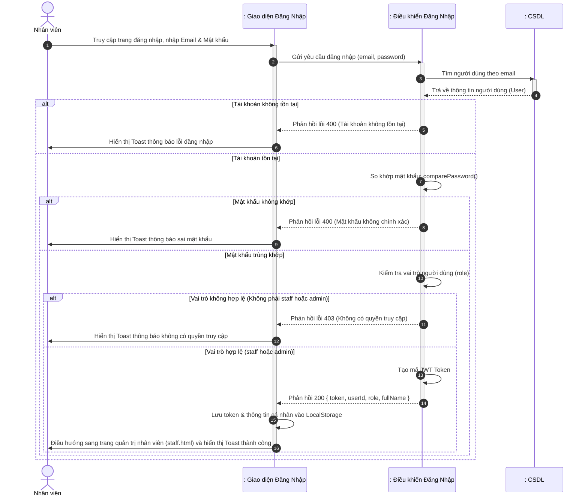

### 1.2. Biểu đồ hoạt động
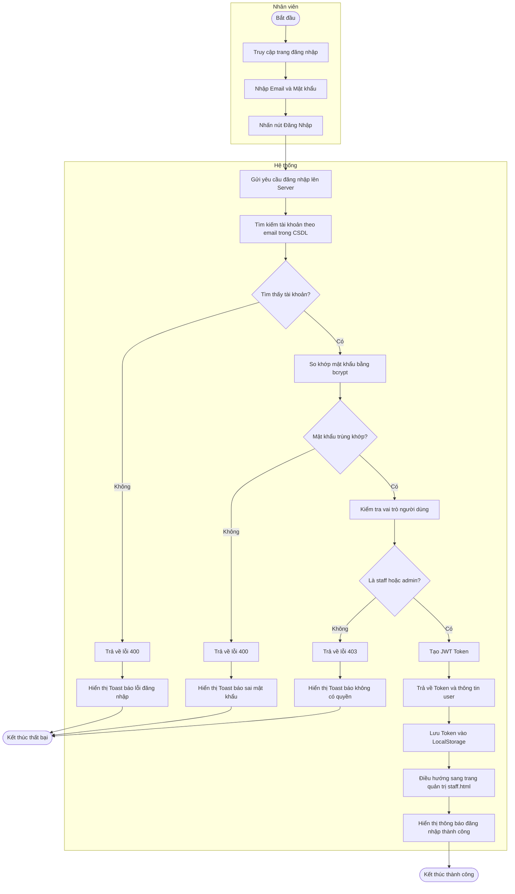

---

## 2. THEO DÕI LỊCH TRỰC (SHIFT TRACKING)

### 2.1. Biểu đồ tuần tự
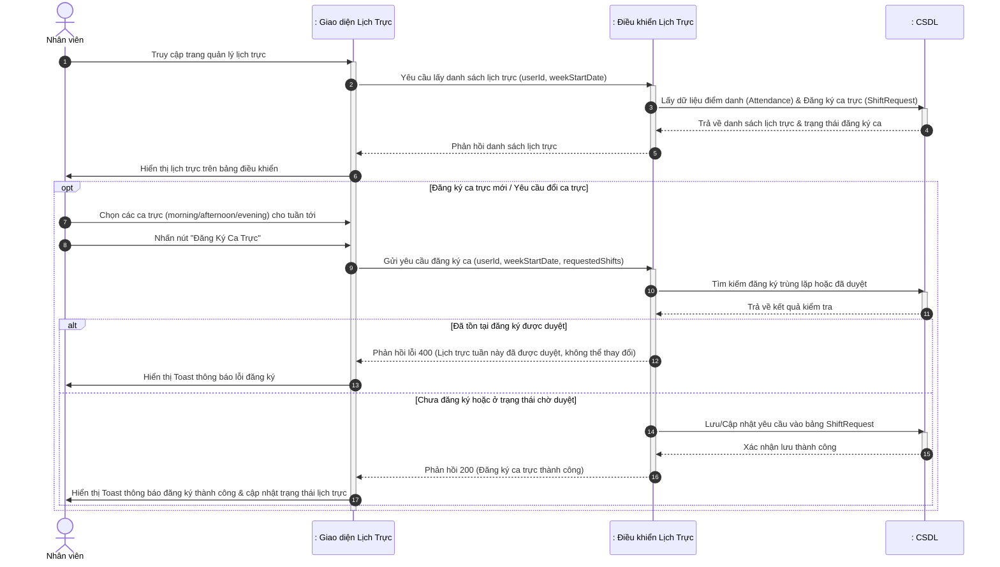

### 2.2. Biểu đồ hoạt động
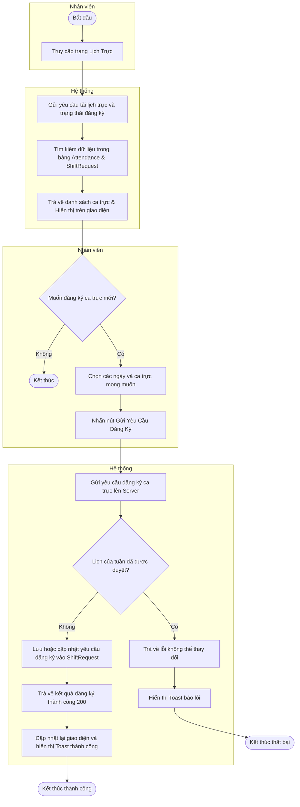

---

## 3. THEO DÕI LƯƠNG (SALARY TRACKING)

### 3.1. Biểu đồ tuần tự
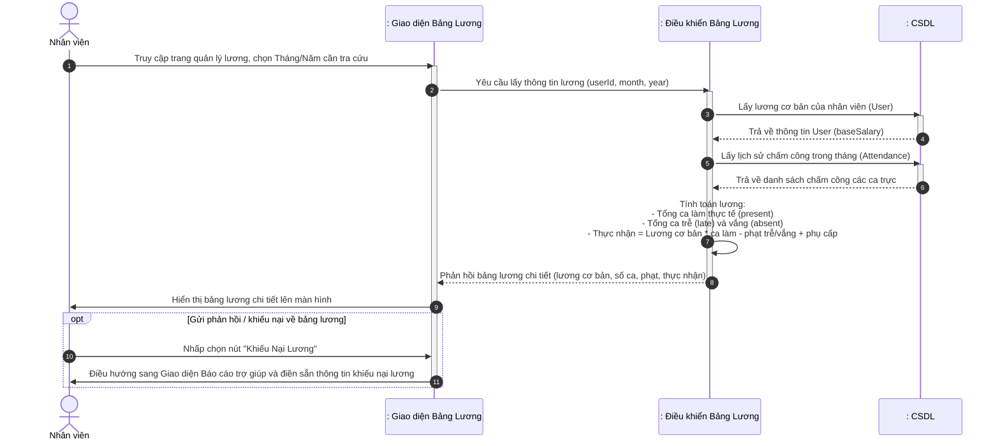

### 3.2. Biểu đồ hoạt động
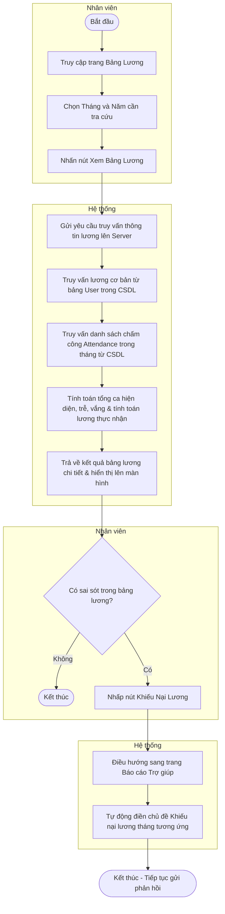

---

## 4. PHẢN HỒI ĐÁNH GIÁ (REPLY TO REVIEWS)

### 4.1. Biểu đồ tuần tự
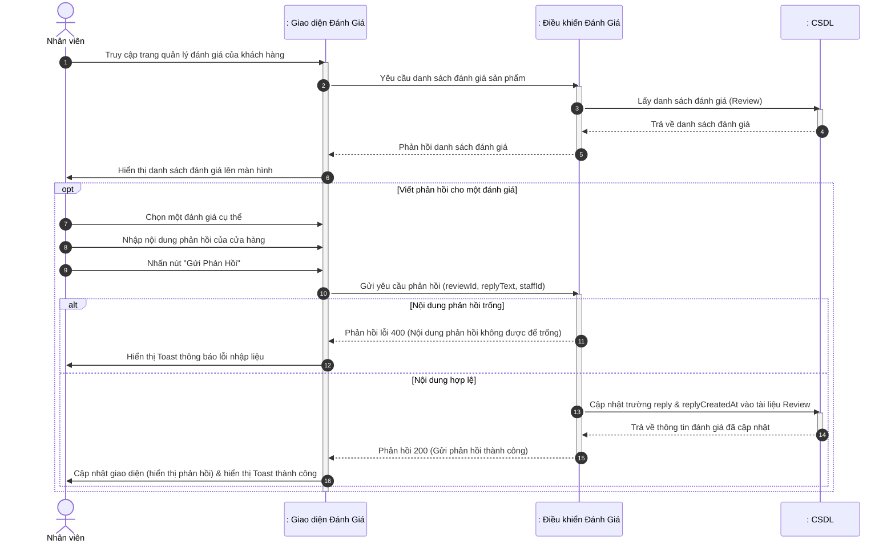

### 4.2. Biểu đồ hoạt động
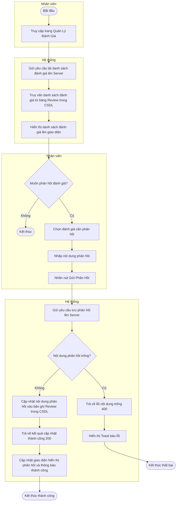

---

## 5. TƯ VẤN TRỰC TUYẾN (ONLINE CONSULTATION)

### 5.1. Biểu đồ tuần tự
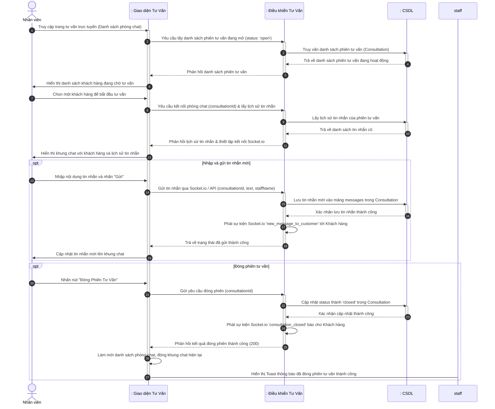

### 5.2. Biểu đồ hoạt động
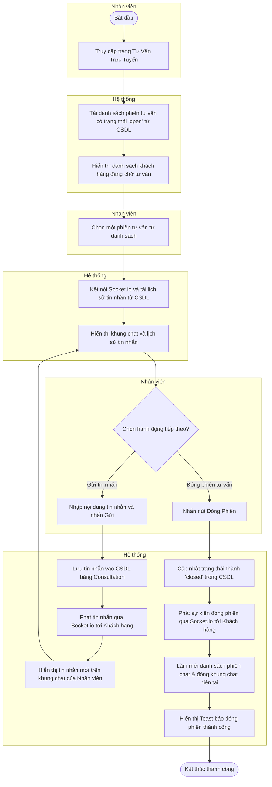

---

## 6. BÁO CÁO TRỢ GIÚP (HELP / SUPPORT REPORT)

### 6.1. Biểu đồ tuần tự
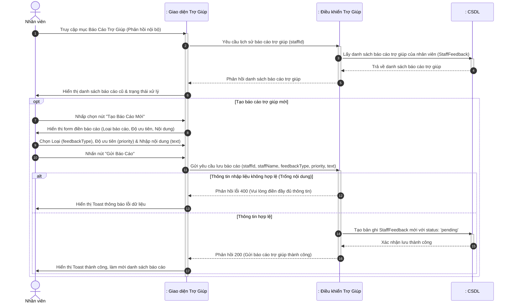

### 6.2. Biểu đồ hoạt động
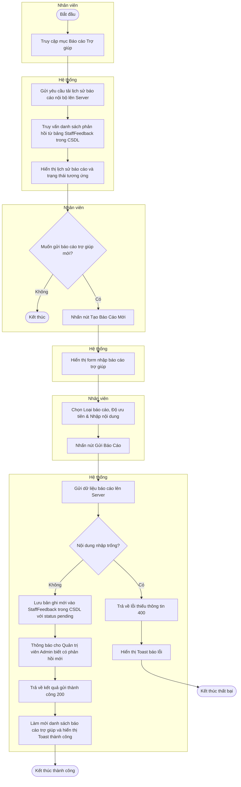

---

## 7. QUẢN LÝ ĐƠN HÀNG (ORDER MANAGEMENT)

### 7.1. Biểu đồ tuần tự
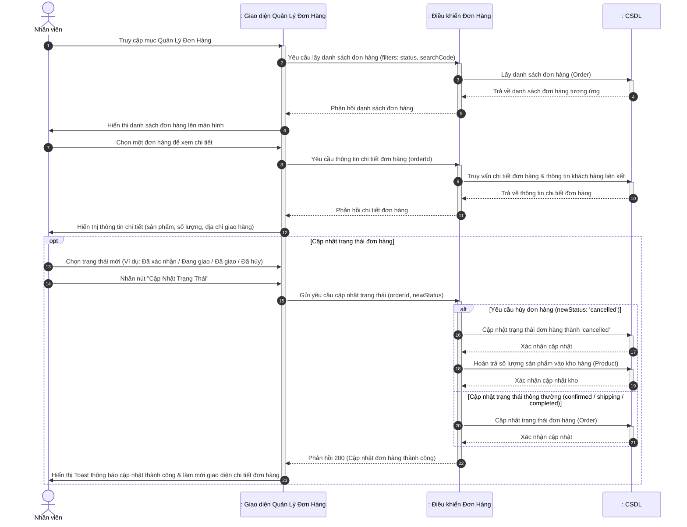

### 7.2. Biểu đồ hoạt động
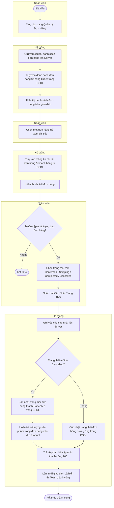

---

## 8. QUẢN LÝ THÔNG TIN CÁ NHÂN (PROFILE MANAGEMENT)

### 8.1. Biểu đồ tuần tự
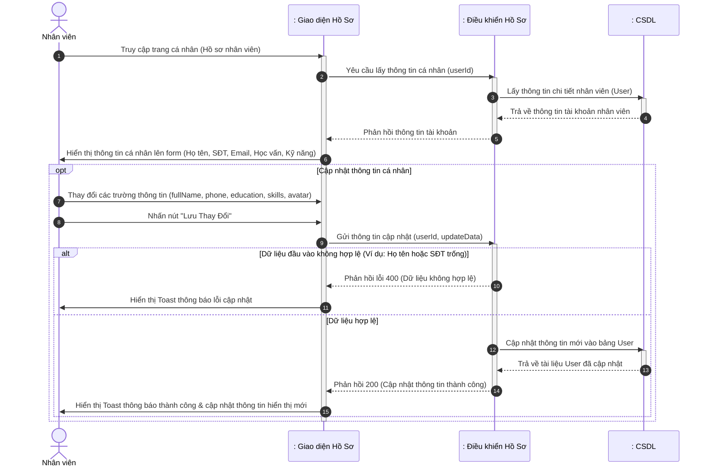

### 8.2. Biểu đồ hoạt động
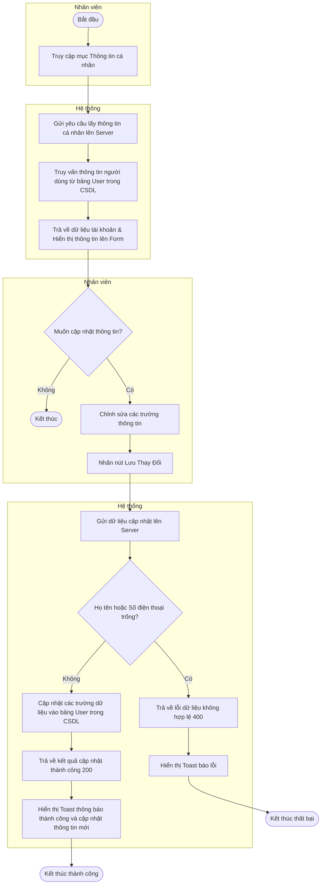
